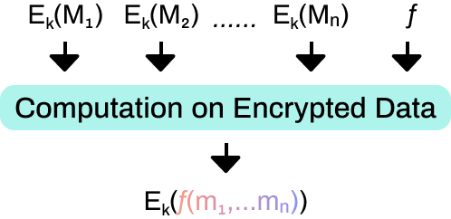

# Fully Homomorphic Encryption

Sometimes, the data owner wants to let the data consumer use his data but not give the data source. He could encrypt his data in a local endpoint and send it to a computation node. The computation node could manipulate the encrypted data in the ciphertext domain. The data consumer could only retrieve the encrypted result. If he got the authorization from the data owner, he could decrypt the result. Otherwise he knows nothing about data or result. Either way, the data source is secure and nobody could render it except the data owner. We call it data computing functionality. The data computing functionality of NuLink will be realized by bridging the fully homomorphic encryption technology to the blockchain system in the future.

It takes advantage of the property that full homomorphic encryption can be used to calculate ciphertext, that is, the user selects the data computing service in the Application Layer. After receiving the authorization, the Cryptography Layer homomorphic encrypts and uploads the user’s data to the Storage Layer. The computing node of the Blockchain Layer will access the data and perform the specified calculation (such as machine learning model prediction, etc.). Finally, the ciphertext result is returned to the Storage Layer, and the Cryptography Layer accesses the ciphertext result, which is decrypted and returned to the user. We will add MPC (multi-party computation) to this solution later.

Fully homomorphic encryption (FHE) refers to the ability to calculate ciphertext without the private key. That is to say, for any valid f and plaintext m, there is a special property f(Enc(m)) = Enc(f(m)).

Full homomorphic encryption is known as the holy grail of cryptography. This problem was proposed by Rivest in 1978. Thirty-odd years later, in 2009, Craig Gentry constructed the first fully homomorphic encryption scheme.

At present, secure and efficient fully homomorphic encryption schemes are based on the LWE problem and Ring-LWE problem on lattice. They are anti-quantum and can provide sufficient security even in the post-quantum era. 

At present, fully homomorphic encryption is restricted by efficiency, which mainly depends on the operation mode of ciphertext. While FHEW and TFHE cryptosystems are more suitable for dealing with boolean logic operations, BGV, BFV and CKKS are more suitable for batching and calculating affine transformations. For nonlinear arbitrary functions, the latest PBS technology has a good efficiency performance. Therefore, NuLink will build different fully homomorphic encryption algorithms to improve efficiency. 

Fully homomorphic encryption has a wide range of theoretical and practical applications, especially in decentralized privacy-preserving products. 

Nodes in the system whose computing power is not strong enough can store their data in the Storage Layer in the form of ciphertext. When data computing is needed, the user initiates computing authorization to the computation nodes. The computation nodes carry on the corresponding ciphertext operation to get the encrypted result, the user downloads the result and decrypts it, and then the final plaintext result can be obtained. In the whole process of computing, only the owner of the data has the ability to decrypt, so users can be guaranteed data privacy. 

We need to emphasize that this can be used as a component of multi-party secure computing, rather than just completing the proxy computation of two parties.

