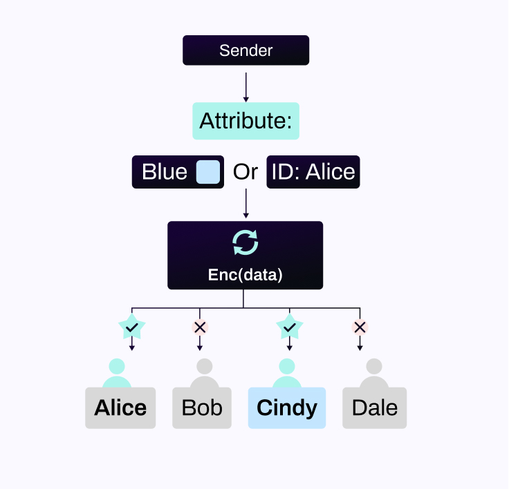

# Identity-Based Encryption and Attribute-Based Encryption

Both identity-based encryption (IBE) and attribute-based encryption (ABE) are public key encryption schemes that control access rights. The former can specify the identity information of the recipient, while the latter can specify the attributes of the receiver. NuLink uses these two technologies to achieve more functional data sharing. 

Using public key encryption to transmit data has certain shortcomings and risks. For example, the public key is generally a series of meaningless random numbers. If the public key is used incorrectly in the encryption process, the ciphertext cannot be decrypted by the correct receiver. At the same time, it is likely to be disclose the information to the wrong user, or even to malicious users. In fact, in real life, there is such an attack method: malicious users deceive the sender and replace the receiver’s public key. 

IBE solves this problem by binding the user’s identity information directly to the public key. It is similar to an ideal email system: If you know someone’s identity, you can send them a letter that only they can read. You can authenticate their signature.

On this basis, ABE has made a further functional expansion. If we define attributes as the characteristics of things or information, policy is the relationship between these features. Then IBE uses the simplest policy and attribute matching, that is, authenticating identity attributes. In ABE, there are more diverse choices of attributes and policies. ABE is generally divided into two categories. KP-ABE (key policy) embeds the policy into the key and the attribute into the ciphertext. CP-ABE (ciphertext policy) embeds the policy into the ciphertext and the attribute into the key. These two schemes have a dual relationship in structure, so analogy transfer is often carried out in the scheme design, but they are very different in their specific application scenarios.

NuLink chooses CP-ABE, because the policy is embedded in the ciphertext. This means that the data owner can decide which attributes can access the ciphertext by setting the policy, which is equivalent to making an encrypted access control for this data whose granularity can be refined to the attribute level.
