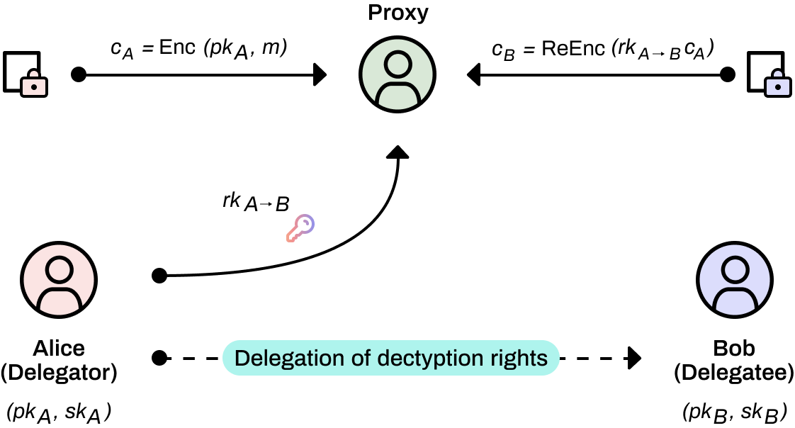

# Proxy Re-encryption

Proxy re-encryption (PRE) is a type of public-key encryption (PKE) that allows a proxy entity to transform or re-encrypt data from one public key to another, without having access to the underlying plain text or private keys. The proxy re-encryption operation process is as follows:

1. Publisher Alice encrypts the data m with her own public key into cA, then Alice sends the ciphertext cA to the proxy and generates a re-encryption key for her, which is calculated by Alice herself.
2. Next, the proxy uses the re-encryption key to convert the ciphertext cA into a ciphertext cB that can be decrypted by Bob with his secret key and sends it to Bob. The proxy only provides computing conversion services and cannot get plaintext. 
3. Bob decrypts the plaintext m that Alice wants to share securely.

Proxy re-encryption plays a role in private data sharing in NuLink. Specifically, NuLink uses the Umbral Proxy Re-Encryption Scheme. Umbral is a threshold Proxy Re-Encryption scheme following a Key Encapsulation Mechanism (KEM) approach. It is inspired by ECIES KEM, and the BBS98 proxy re-encryption scheme. With Umbral, Alice – the generic name for data owners in NuLink KMS (Key Management System) – can delegate decryption rights to Bob for any ciphertext intended to her through a re-encryption process performed by a set of N semi-trusted proxies. When at least t of these proxies (out of N) participate by performing re-encryption, Bob is able to combine these independent re-encryptions and decrypt the original message using his private key. 

Using Umbral, NuLink can not only easily realize single-user to single-user private data sharing – we emphasize again that Umbral is a threshold scheme – NuLink can also realize single-user to multi-user private data sharing.
