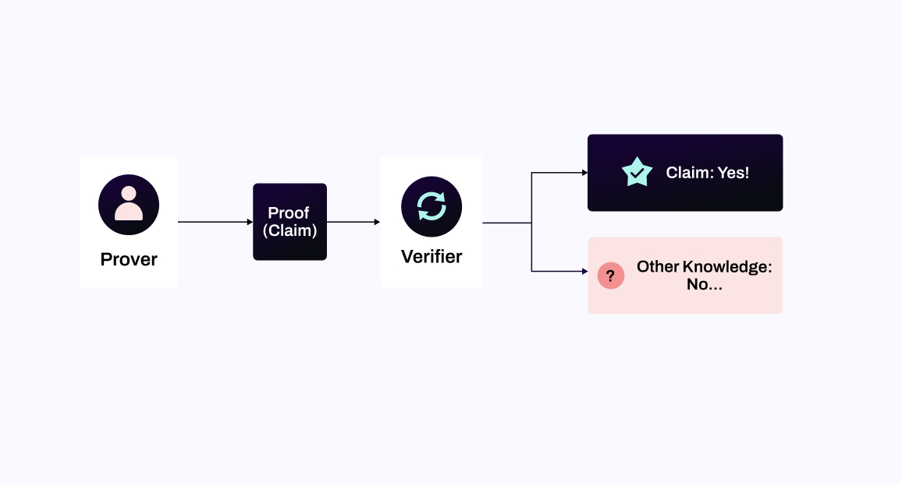

# Zero-Knowledge Proof

Zero-Knowledge Proof (ZKP) means that the prover makes the verifier believe that a certain conclusion is correct without providing any useful information to the verifier. Zero-Knowledge Proof was first proposed by S Goldwasser et al in 1989. It has the following three properties: 

* Completeness: If both the prover and the verifier party are honest and follow every step of the proof process, then the proof must be successful and the verifier must accept the prover.

* Soundness:  No one can forge a new proof and successfully make it pass verification.

* Zero Knowledge: After the verification process, the verifier verifies that the prover has the knowledge but does not get any information about that knowledge. From the point of view of the prover, they did not breach privacy.

By whether the participants need to interact or not, Zero-Knowledge Proof can be divided into Interactive Zero-Knowledge Proof and Non-Interactive Zero-Knowledge Proof or NIZK. NIZK is suitable for decentralized scenarios. The commonly used NIZK schemes are zk-SNARK, zk-STARK, Bulletproofs, PLONK, Supersonic, Malin and so on. Each scheme has its own advantages and we can choose the appropriate one depending on the different scenarios involved. 

ZKP provides an additional layer of security and privacy for users by providing publicly verifiable proof, making sure that users of the NuLink network can easily verify that their data is being correctly stored and processed
