# NuLink Agent Setting

Select 'Developer mode' to see more settings.

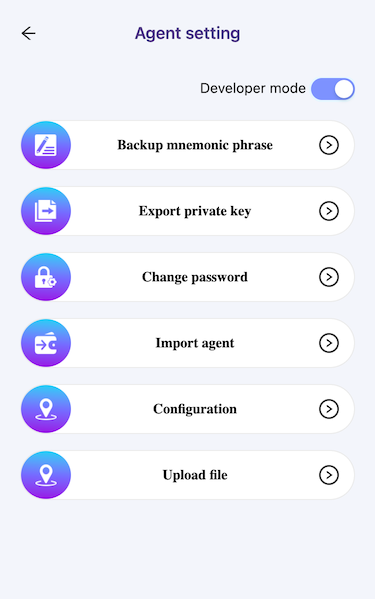

## Password Verification
Password is required for each setting operation. Input your NuLink Agent password to make settings.

## Backup Mnemonic Phrase
Backup mnemonic phrase is important to protect your assets security. So backup your mnemonic phrase after Agent account created.

* After the password verification, show the tips for backup menemonic phrase, please read the following instructions carefully.

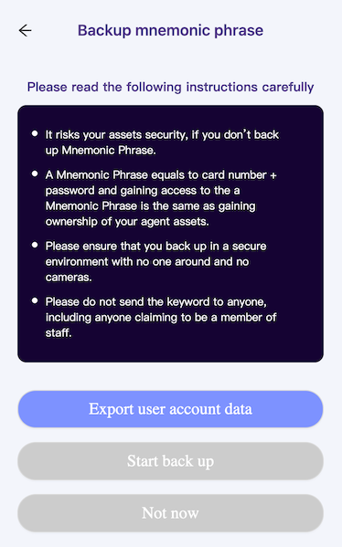

* Before backup the mnemonic phrase, click 'Export user account data' to export user account data, which named strategy.json. It is required when you want to import mnemonic phrase or private key.
* Click 'Start back up' button, and start back up menemonic phrase.

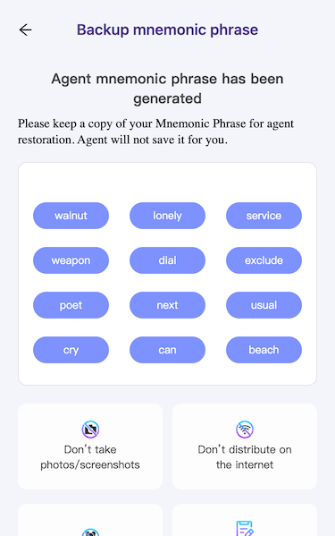

## Export Private Keys
* After the password verification, show the tips for export private key tips, please read the following instructions carefully.

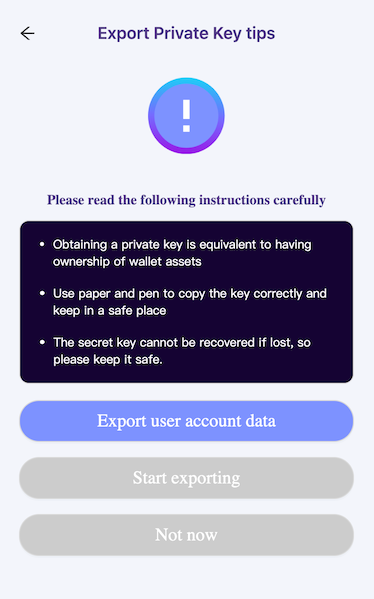

* Before export the private key, click 'Export user account data' to export user account data, which named strategy.json. It is required when you want to import mnemonic phrase or private key.

* Click 'Start exporting' button, and start exporting private key.

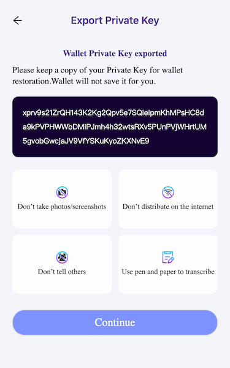

## Change Password
If you want to change the Agent password, you should restore your Mnemonic Phrase, and set new password.

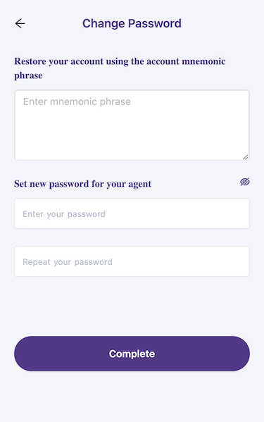

## Import Agent

This page helps to import agent data, it supports importing mnemonic phrase and private key.

### Import Mnemonic Phrase

1. Input your mnemonic phrase
2. Set password

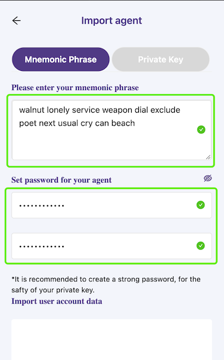

3. Import User account data

Drag and drop user account data to the area, or click the area to select user account data file.

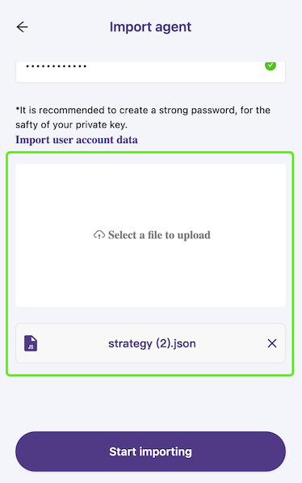

4. Import

Click 'Start importing' to import mnemonic phrase and user account data to agent.

### Import Private Key

1. Input your private key
2. Set password

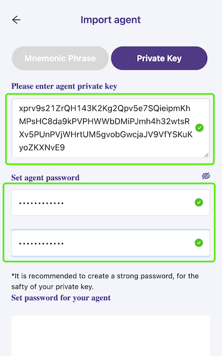

3. Import User account data

Drag and drop user account data to the area, or click the area to select user account data file.

4. Import

Click 'Start importing' to import private key and user account data to agent.

## Configuration

This page display the configurations, include:
* Network (only Hours testnet support now)
* RPC URL
* IPFS URL
* Backend URL

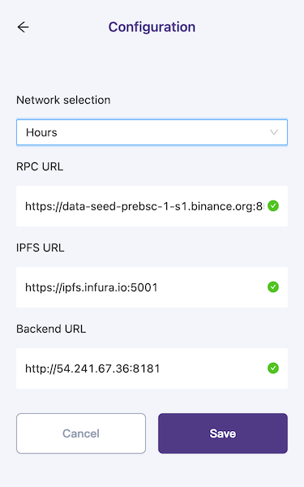

## Upload File
'Update File' helps to update file to IPFS.
Drag and drop the file into the frame to upload, or click 'Upload File' button to select file to upload.
Only one file can be uploaded every time.

After drop the file or select the file, can select a tag, confirm upload to upload the file.

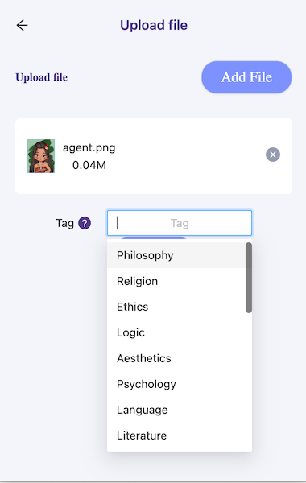