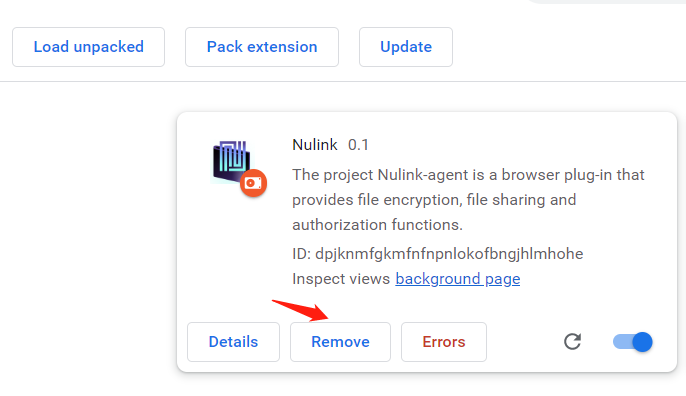
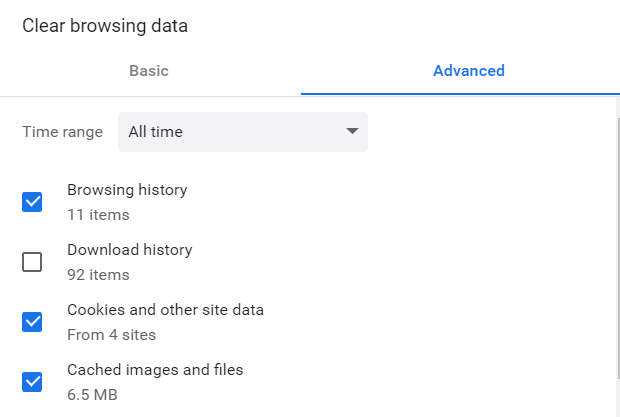

# NuLink Agent Update

Anytime when the agent package is updated, the user need to update the agent to the newest version. There are three steps to update the agent:

1. Remove the old package in extension  
2. Download the new package and install in extension  
3. Create a new account  

## Remove the old package in extension  

First remove the current package in extension.  

  

And do not forget to clear the cache and cookie.  

  

## Download the new package and install in extension  

Now NuLink Agent hasn't been published on Chrome Web Store. You can install NuLink Agent manually.

1. Download [NuLink Agent package](https://download.nulink.org/release/agent/nulink-agent-1.0.zip), unpack it.
2. Open the Extension Management page by navigating to chrome://extensions.
   The Extension Management page can also be opened by clicking on the Chrome menu, hovering over More Tools then selecting Extensions.
3. Enable Developer Mode by clicking the toggle switch next to Developer mode.
4. Click the Load unpacked button and select the extension directory.

   
   
   The extension has been successfully installed.
5. Click Extensions button and pin the NuLink Agent extention to the toolbar.

   

## Create new account
First time click the Agent, the main page looks like this:

1. Click Create wallet button, create wallet first.

2. Set Password
NuLink Agent uses passwords to secure the app, once you've restored or created your wallet from your secret recovery phrase, you will use your password to unlock the app.
Please set a strong password to protect your wallet safety.

   

3. Create
When creating succeed, go to the backup mnemonic phrase. 

   

Now can use NuLink Agent.

   
