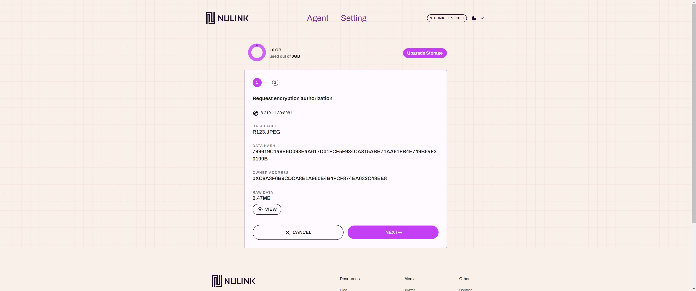
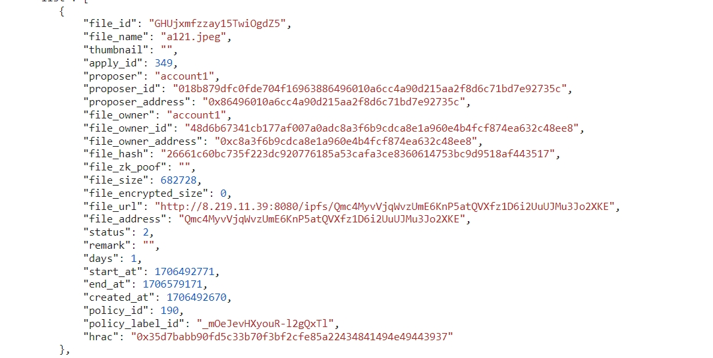
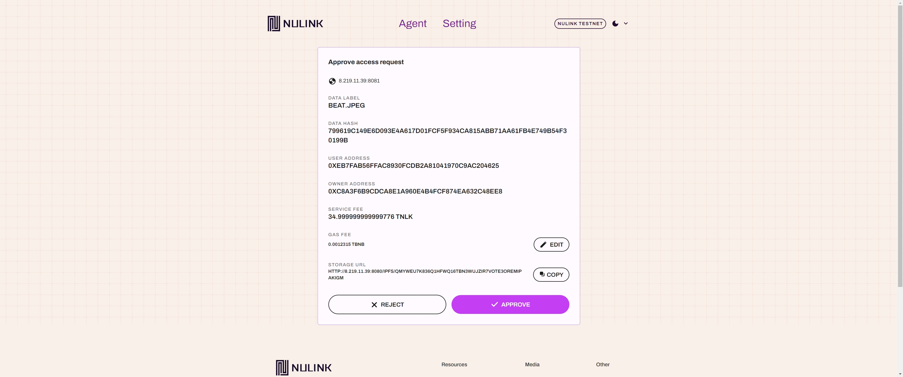

# NuLink Agent SDK

The NuLink Agent SDK is a robust toolkit designed to empower developers in seamlessly integrating [NuLink Agent](../product/nulink_agent.md) functionality into their decentralized applications (DApps). Bridging the communication between DApps and the NuLink Agent, this comprehensive SDK provides essential software development tools and resources. You can use it in the browser or in a Node.js runtime. By incorporating the NuLink Agent SDK into your DApp, you enable a secure and efficient connection to the NuLink Agent, which acts as an intermediary for handling privacy-sensitive data requests,such as connect, upload data, apply, approve, and download.

Explore the potential of the NuLink Agent SDK with this documentation, guiding you through the integration process to create DApps that prioritize privacy and innovative functionalities. 


## Environment

The following is the supported blockchain and its associated chain ID for your reference.

| Network                  | Chain ID |
|--------------------------|----------|
| Horus (BSC Testnet)      | 97       |
| Conflux eSpace Testnet   | 71       |


The following are the URLs for the NuLink Agent:

- Testnet: https://agent.testnet.nulink.org


## Getting Started


## Install
To get started, you need to install the NuLink Agent SDK into your project using either of the following commands:

```bash
npm i @nulink_network/nulink-web-agent-access-sdk
```
or
```bash
yarn add @nulink_network/nulink-web-agent-access-sdk
```


## Initial configration 

After the installation, you'll need to set the configurations in the .env file of your project:

 - REACT_APP_NULINK_AGENT_URL:  the web agent address
 - REACT_APP_CENTRALIZED_SERVER_URL: the backend service address
 - REACT_APP_STAKING_SERVICE_URL: the staking service address
 - REACT_APP_BSC_TESTNET_PORTER_URL: the porter service address
 - REACT_APP_DEFAULT_NETWORK_CHAIN_ID: the network chain id

Here's an example of how to modify the .env file in your project:

```
// modify .env in your project
// web agent address
REACT_APP_NULINK_AGENT_URL=xxxxxx
// agent backend service address
REACT_APP_CENTRALIZED_SERVER_URL=xxxxxx
// staking service address
REACT_APP_STAKING_SERVICE_URL=xxxxxx
// porter service address
REACT_APP_BSC_TESTNET_PORTER_URL= xxxxxx
// chain Id
REACT_APP_DEFAULT_NETWORK_CHAIN_ID=xx
```

The following lists the default configuration in the NuLink Agent SDK:

* NuLink web agent address: https://agent.testnet.nulink.org
* Backend service address: https://agent-integration-demo.nulink.org/bk
* NuLink staking service address: https://staking-api.testnet.nulink.org
* NuLink porter service address: https://porter-api.testnet.nulink.org
* The network chain id: 97


## How to use

- [Interacting with NuLink Agent](#interacting-with-nulink-agent)
- [Upload data](#upload-data)
- [Apply Data](#apply-data)
- [Approve the apply data as publisher](#approve-the-apply-data-as-publisher)
- [Download data](#download-data)

### Interacting with NuLink Agent

The most common action is Sign In, where the user is redirected to the Wallet page to authorize the application.
Once the user has successfully signed in, an access key is stored in the browser's LocalStorage.
Subsequent actions that require the access key will be permitted.

```typescript
    import { connect } from "@nulink_network/nulink-web-agent-access-sdk"

    const gotoConnect = async () => {
        await connect(loginSuccessHandler)
    }
    
    const loginSuccessHandler: CallBackFunc = async (responseData) => {
        if (responseData) {
            // Do something with the responseData
            console.log(responseData);
        } else {
            // Handle the error case
            console.error('Failed to login in');
        }
    }
```
When the connect interface is called, the browser will be redirected to NuLink Agent, where user authentication is performed on the Agent side.
Once the authentication is completed, the agent-access-sdk will store the user information in the LocalStorage of the calling side,
indicating that the login process has been completed.

### Upload data

There are four interfaces available for uploading data as publisher: uploadData, uploadDataBatch, uploadFile, and uploadFileBatch.
By calling these upload interfaces, you can navigate to the Agent upload page to complete the upload. After the upload is completed,
you will receive the dataLabel and dataHash of the uploaded data.

```typescript
import { uploadData } from "@nulink_network/nulink-web-agent-access-sdk"

const _uploadAction = async () => {
    await uploadData({ dataLabel : dataLabel, fileBinaryArrayBuffer: blob }, async (responseData) => {
      if (responseData) {
        // Do something with the responseData
        console.log(responseData.dataInfo);
      } else {
        // Handle the error case
        console.error('Failed to upload');
      }
    })
}
```

```typescript
import { uploadDataBatch } from "@nulink_network/nulink-web-agent-access-sdk"

const _uploadAction = async () => {
    await uploadDataBatch(dataList, async (responseData) => {
      if (responseData) {
        // Do something with the responseData
        console.log(responseData.dataInfo);
      } else {
        // Handle the error case
        console.error('Failed to upload');
      }
    })
}
```

```typescript
import { uploadFile } from "@nulink_network/nulink-web-agent-access-sdk"

const _uploadAction = async () => {
    await uploadFile( file, async (responseData) => {
      if (responseData) {
        // Do something with the responseData
        console.log(responseData.dataInfo);
      } else {
        // Handle the error case
        console.error('Failed to upload');
      }
    })
}
```

```typescript
import { uploadFileBatch } from "@nulink_network/nulink-web-agent-access-sdk"

const _uploadAction = async () => {
    await uploadFileBatch( files, async (responseData) => {
      if (responseData) {
        // Do something with the responseData
        console.log(responseData.dataInfo);
      } else {
        // Handle the error case
        console.error('Failed to upload');
      }
    })
}
```


By calling the ``` getFileList ``` API, you can retrieve all the uploaded data within the Agent.

### Apply Data

When applying for data, you can use the apply method from the Agent SDK to pass the file information to NuLink Agent.
This will open the application page of NuLink Agent where you can complete the application process.
The file information can be obtained from the ``` getFileList ``` and ``` getFileDetail``` API.

```typescript
import { apply } from "@nulink_network/nulink-web-agent-access-sdk"

const applyForFile = async () => {
  await apply(_dataName, _dataId, _dataCreatorAddress, _dataUrl, _dataHash, _zkProof, _usageDays, async () => {
    if (responseData) {
      // Do something with the responseData
      console.log(responseData);
    } else {
      // Handle the error case
      console.error('Failed to upload');
    }
  });
};
```


You can retrieve the data that the user has applied for by using the ``` getSendApplyFiles``` function
In the response data of ``` getSendApplyFiles```, the value of the "status" field indicates the approval status of the data,
where 1 represents "applying" 2 represents "approved" and 3 represents "rejected"

### Approve the apply data as publisher

By calling the ``` getIncomingApplyFiles``` function, you can retrieve all the incoming apply data of the user



calling the ``` approve ``` function, you can pass the data that needs to be approved to NuLink Agent.
The data information can be obtained from the ``` getIncomingApplyFiles ``` API.
The number of backup nodes required for the ```approve ``` method can be obtained by calling the ```getUrsulaNumber ``` API



In the response data of ``` getIncomingApplyFiles```, the value of the "status" field indicates the approval status of the data,
where 1 represents "applying" 2 represents "approved" and 3 represents "rejected"

### Download data

Once the data requested by the user is approved, it can be downloaded

calling the ```download``` function, you can pass the information for downloading the data to NuLink Agent. The ``` download``` function will return the binary buffer of the downloaded data
#### Example

```typescript
import { download }  from "@nulink_network/nulink-web-agent-access-sdk"

const fileDownload = async () => {
    await download(
        detailItem.file_id,
        detailItem.file_name,
        detailItem.file_hash,
        detailItem.creator_address,
        detailItem.file_zk_poof,
        detailItem.file_url,
        detailItem.file_encrypted_size,
        fileDownloadCallBack,
    );
};

const fileDownloadCallBack = async (data) => {
    try {
        if (!!data && data.arrayBuffer) {
            const blob = new Blob([data.arrayBuffer], { type: 'arraybuffer' })
            const url = window.URL.createObjectURL(blob)
            const link = document.createElement("a");
            link.style.display = "none";
            link.href = url
            link.setAttribute("download", data.fileName);
            document.body.appendChild(link);
            link.click();
            document.body.removeChild(link);
        }
    }catch (error){
        throw new Error("Decryption failed, Please try again")
    }
}
```


## Utilities

The default network for the NuLink Agent SDK is Horus (BSC Testnet), with a chain ID of 97

``` getNetWorkChainId``` can be used to retrieve information about the current chain ID.
``` setNetWorkChainId``` can be used to change the chain ID.

Explore the [nulink-web-agent-integration-demo](https://github.com/NuLink-network/nulink-web-agent-integration-demo.git) repository for a practical example of Dapp integration with the NuLink Agent SDK.

