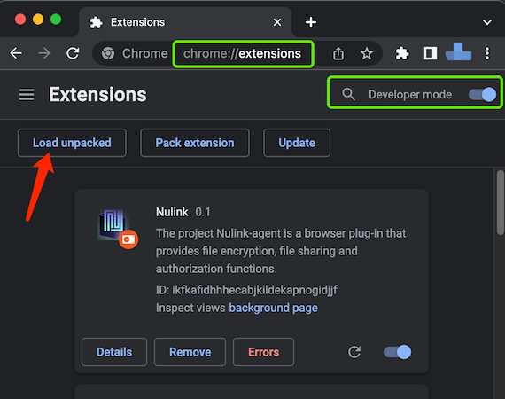
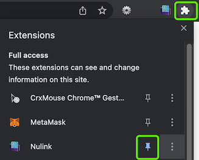
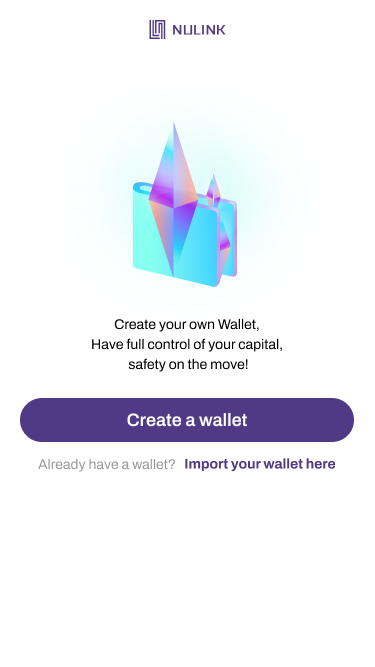
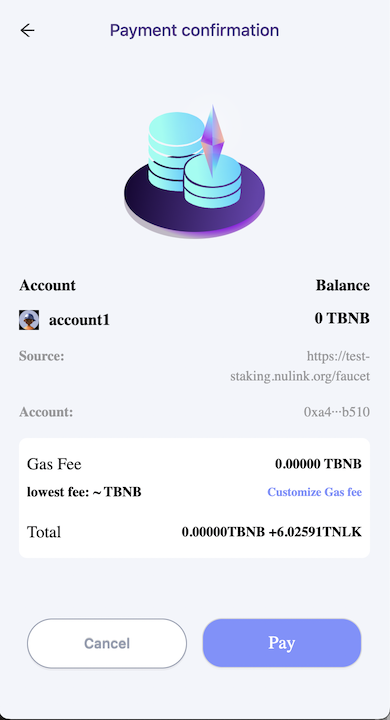
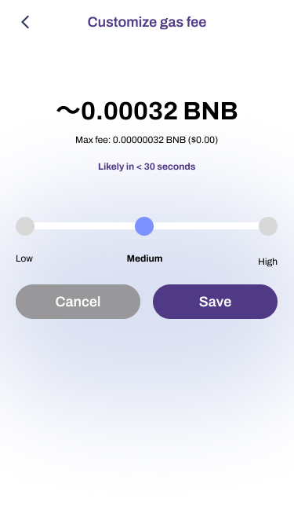

# NuLink Agent

## What is NuLink Agent?
NuLink Agent is a web browser extension that allows you to manage your NuLink private kay and vault data. It allows you to interact with file sharing or other dapps.

## Install

Now NuLink Agent hasn't been published on Chrome Web Store. You can install NuLink Agent manually.

1. Download [NuLink Agent package](https://filetransfer.nulink.org/release/nulink_agent_0.7.4.zip), unpack it.
2. Open the Extension Management page by navigating to chrome://extensions.
   The Extension Management page can also be opened by clicking on the Chrome menu, hovering over More Tools then selecting Extensions.
3. Enable Developer Mode by clicking the toggle switch next to Developer mode.
4. Click the Load unpacked button and select the extension directory.

   
   
   The extension has been successfully installed.
5. Click Extensions button and pin the NuLink Agent extention to the toolbar.

   

## Create wallet
First time click the Agent, the main page looks like this:

1. Click Create wallet button, create wallet first.

2. Set Password
NuLink Agent uses passwords to secure the app, once you've restored or created your wallet from your secret recovery phrase, you will use your password to unlock the app.
Please set a strong password to protect your wallet safety.

   

3. Create
When creating succeed, go to the backup mnemonic phrase. 

   

Now can use NuLink Agent.

   

## Transactions and Gas

### Connect to Agent

At NuLink File Sharing or other DApp, when connecting to Agent, confirm the connecting website and connecting account, click 'Connect' to confirm the connection of DApp and Agent.

### Payment confirmation

* Gas fee
The gas fee is the total, global amount paid for the transaction. It is calculated as: (base fee + priority fee) x units of gas used. Agent initially sets this amount based on the previous block’s history. However, users can edit this amount through custom settings (see below). 

* Total
To total is the total cost for the transaction, include gas fee (BNB) and service fee (NLK).

### Customize gas fee
Gas fee refers to the transaction fee on the blockchain. It is what users pay to get their transaction validated, or completed.
User can customize gas fee to accelerate the transaction confirmation time.

## Setting
Click the icon in the upper right corner of main page, jump into Setting page to make settings.
Visit [Agent Setting](./agent_setting.md) to get more helps.