# NuLink Agent

## What is NuLink Agent?
NuLink Agent is a web-based digital wallet that differs from traditional plugin wallets in that it does not need to be installed on the browser. 
Instead, users can simply open a webpage and login to manage their NuLink private account data and digital assets, as well as interact with other DApps.

When browsing third-party DApps, if the application supports NuLink account authorization login, users can launch the NuLink Agent authorization login page for logging in. After logging in to the NuLink Agent account, users can perform a series of on-chain operations such as applying for fund account authorization, transferring funds, uploading files, and more. All of these operations will be recorded on the blockchain.

## Access NuLink Agent

* [NuLink Agent for Testnet](https://agent.testnet.nulink.org)
* NuLink Agent for Mainnet (In development...)

## Registration

Open NuLink Agent [https://agent.testnet.nulink.org ](https://agent.testnet.nulink.org) or https://agent.nulink.org (in development). 

If you are a new user, you need to register by clicking "Create an Agent account" and proceeding to the next step.

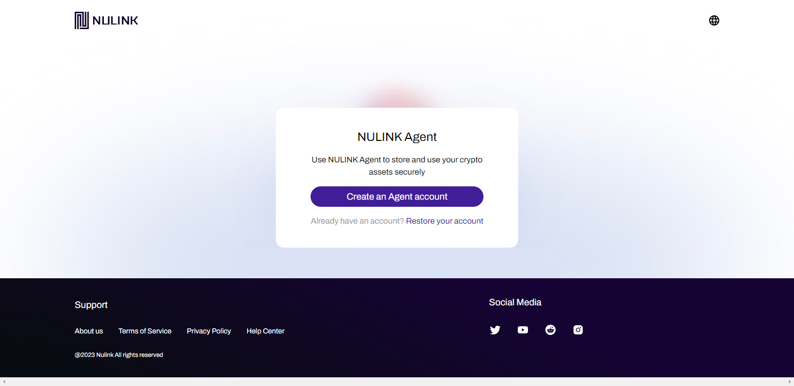

Read the prompts, user agreement, and privacy policy, and continue to create your account by clicking "Sign Up."

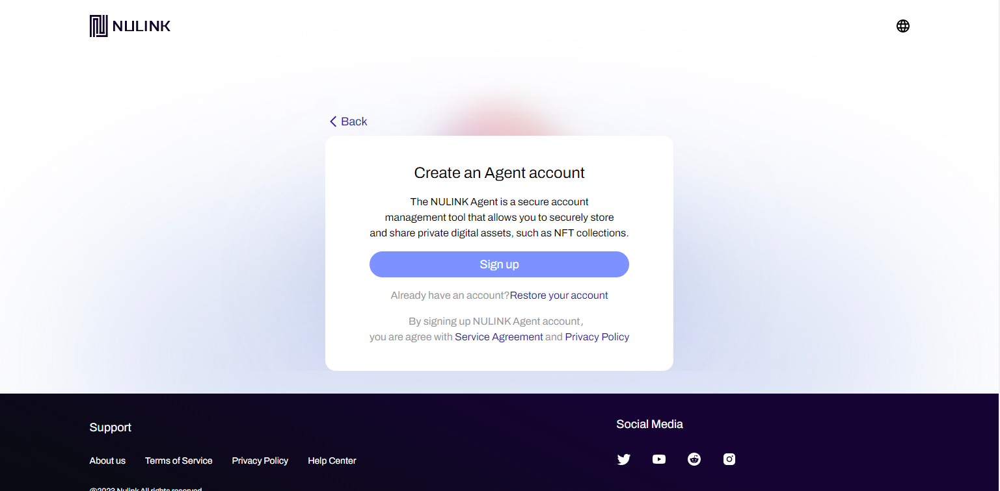

Continue to the next step to set your password. You need to repeat the password twice to ensure that you remember it. This password is used to confirm your identity when performing certain account security-related operations.

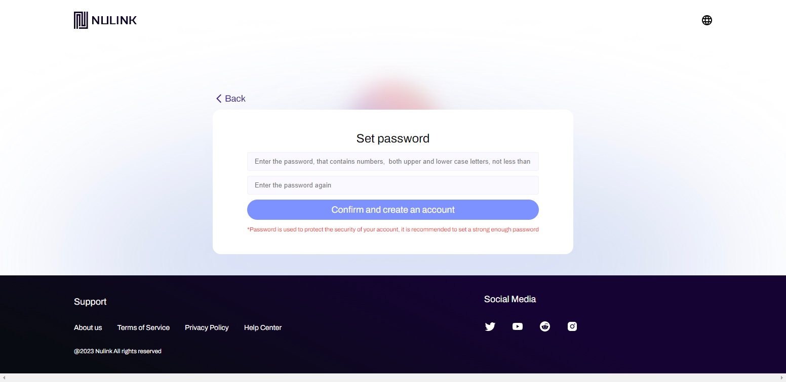

## Backup Mnemonic

After registration, it is essential to back up your mnemonic. The mnemonic is used to restore your account. Even if you change your computer, you can recover your account as long as you have your mnemonic.

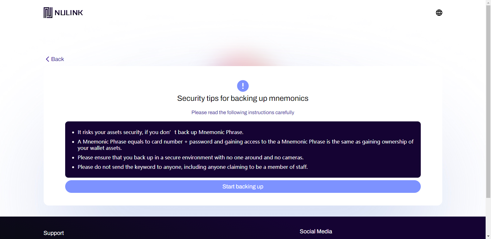

Here is your mnemonic, which can be copied to your computer by clicking "Copy." It is best to write it down in your notebook to prevent accidental deletion or loss.

Finally, to ensure that you have saved your mnemonic correctly, verify its accuracy by writing down the corresponding words as prompted. Once completed, a verification success message will appear.

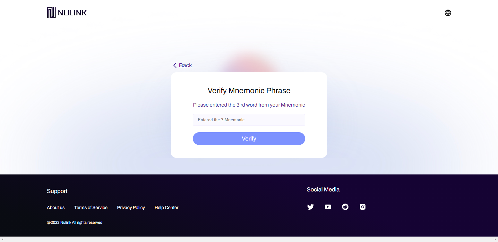

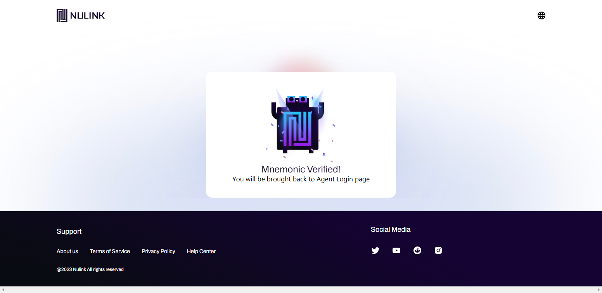

## Account Recovery
If you already have an account and have saved your mnemonic, you can click "Restore your account" and enter your mnemonic to recover your account.

Enter your mnemonic and then reset your password. Once completed, a success message will appear.

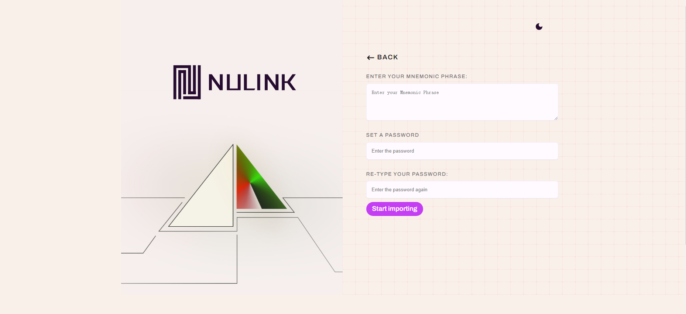
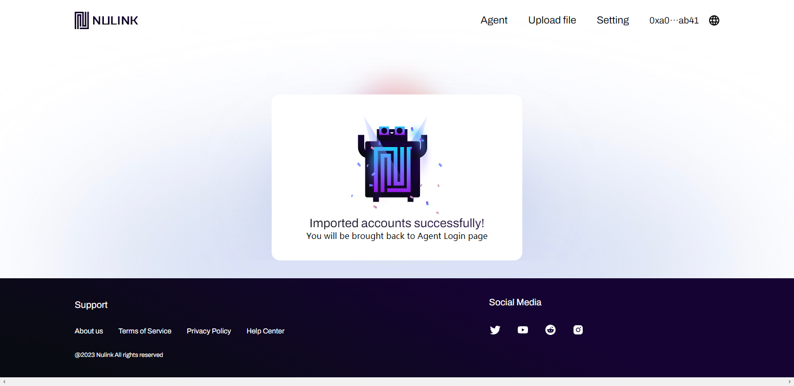

## Homepage
After registering or recovering your account, the page will automatically redirect to your account homepage, where you can see all your token balances. Currently, two tokens are supported: NLK and BNB, and you can also see your transaction records.

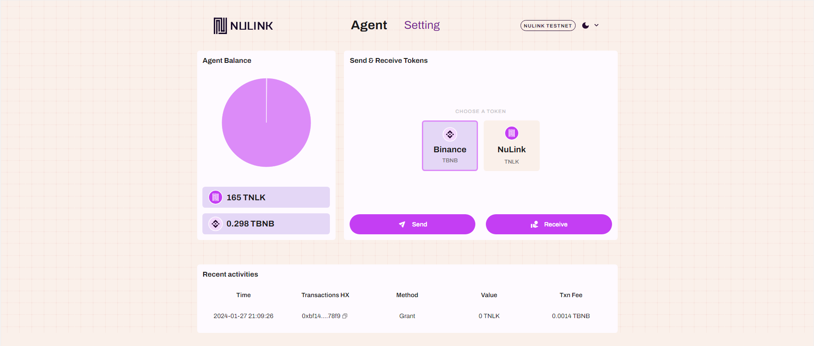

## Transfer
Click "Send" on the account homepage to enter the transfer page. Choose the token, enter the receiver's address and amount, or click "Transfer all" to transfer all your balances at once. After verifying the information, click "Confirm and transfer" to complete the transfer. A certain amount of gas fees will be charged for each transaction.

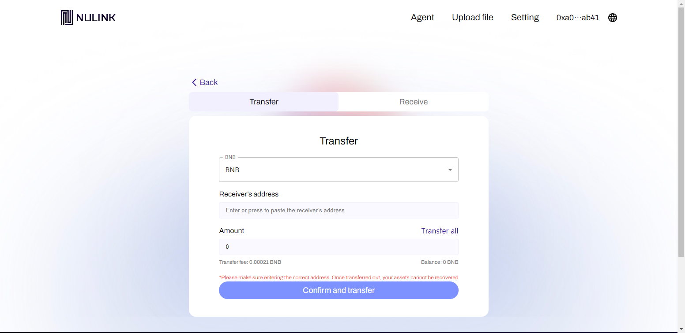

## Receive
Click "Receive," and your account address and a QR code will appear. The QR code contains your account address, making it easy for others to transfer funds by scanning it without manually entering the address.

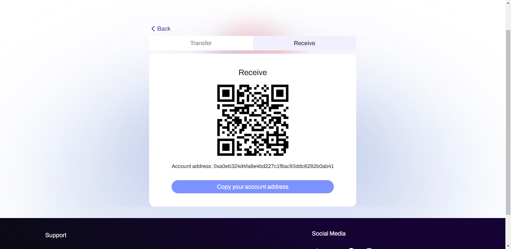

## Settings
Click "Settings" and switch to "Network Set up." The system has already preset the RPC URL, but if you have a faster RPC URL, you can set it yourself to get a better experience.

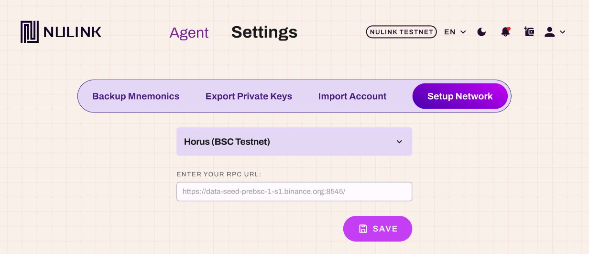

## Export Private Key
The private key contains all account information. The purpose of exporting the private key is to enable users to view their account information in other wallets. For example, users can import the private key of NuLink Agent to MetaMask to view their account information on NuLink Agent.

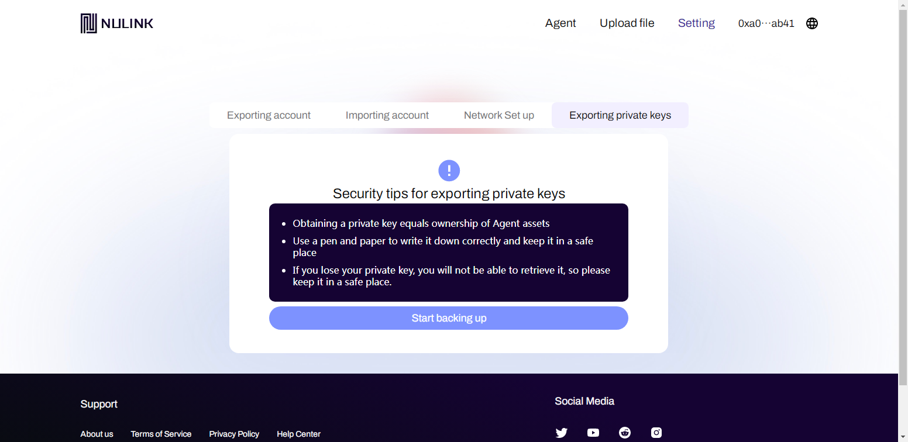

Please read the following security tips carefully to ensure the privacy during the export process. Click "Start backing up," enter the account password, and the private key information will be displayed.

After obtaining the private key, click "copy" below to quickly save your private key. Please follow the security tips below to keep your private key safe.

