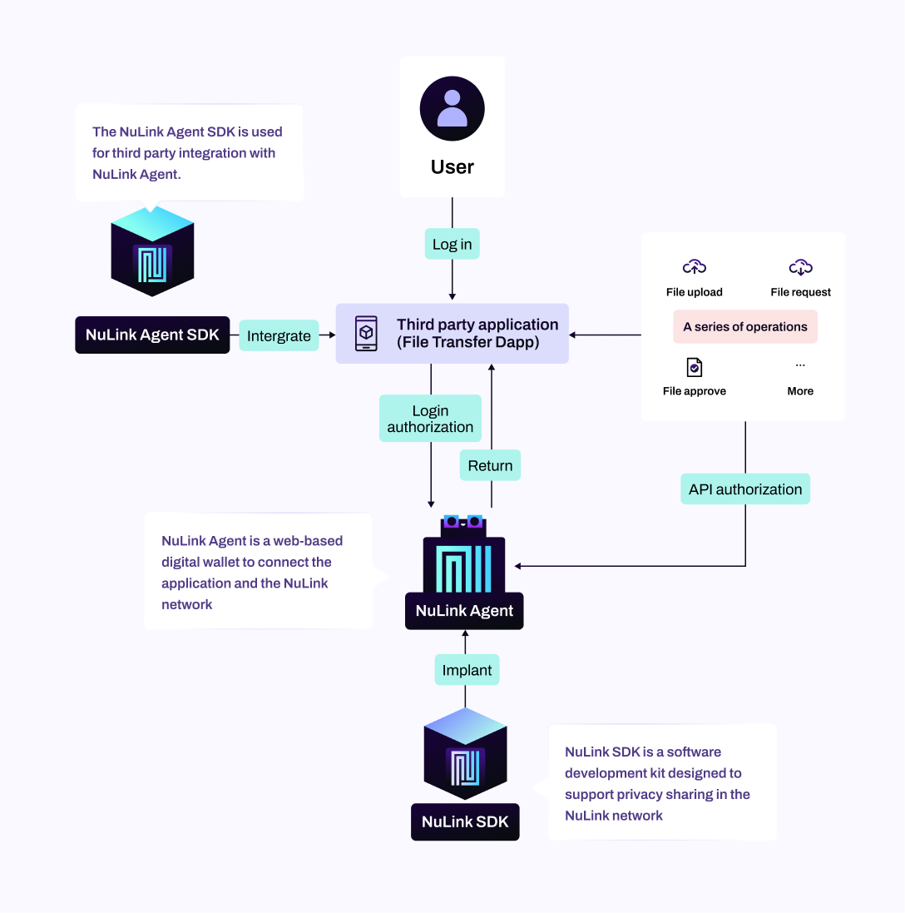

# NuLink Product Overview

NuLink's product offerings are designed to meet the specific requirements of both the supply and demand sides in the decentralized ecosystem. The platform comprises tools and solutions tailored for stakers, DApp builders, and DApp users, ensuring a comprehensive and inclusive approach to data privacy and management.

## Supply Side

The supply side in NuLink refers to stakers—individuals who stake their NLK token and provide services in the NuLink network. In NuLink, there are four types of stakers: proxy workers, computation nodes, storage providers, and watchers. Currently, only proxy workers are online.

Stakers initiate their participation by depositing NLK tokens using the NuLink Staking Dashboard. Subsequently, they install and start running the corresponding service node installer (e.g., proxy workers use the NuLink Worker Installer). Once the NuLink worker node is successfully running, stakers bond the node to their staking account through the NuLink Staking Dashboard to start receiving rewards.

### For Stakers

[**Stakers**](stakers.md) are essential contributors to the NuLink network, providing valuable services and earning rewards. NuLink offers dedicated tools for stakers:

* [**NuLink Staking Dashboard:**](./staker/dashboard.md) A user-friendly interface empowering stakers to efficiently manage staking activities. It allows them to stake token, bond node, monitor contributions, track rewards, and ensure the smooth operation of NuLink services.

* [**NuLink Worker Node Installer:**](./staker/nulink_worker.md) The NuLink Worker Node Installer simplifies the deployment of NuLink worker nodes.

## Demand Side

The demand side in NuLink involves users who pay NLK to obtain services from the supply side. The products for the demand side are categorized into two types: those for DApp builders (NuLink Agent SDK and NuLink SDK) and those for DApp users (NuLink Agent and NuLink Snaps). The relationships between these components and layers are visualized in a diagram, highlighting the interconnectedness and collaborative nature required for the successful operation of the NuLink network.

### For DApp Builders

[**DApp builders**](dapp_builders.md) play a crucial role in integrating NuLink's data privacy services into their products. NuLink provides two powerful SDKs to facilitate seamless integration:

* [**NuLink Agent SDK:**](./staker/nulink_sdk.md)The NuLink Agent SDK equips developers with essential software development tools and resources. It empowers them to seamlessly integrate NuLink Agent functionality into their applications. This SDK enables secure and efficient communication between DApps and the NuLink network.

* [**NuLink SDK:**](./staker/nulink_sdk.md)The NuLink SDK is a robust and comprehensive software development kit designed to provide developers with extensive capabilities. It facilitates flexible connections with the NuLink network, enabling advanced cryptographic operations and seamless interaction. Developers can leverage the NuLink SDK to unlock the full potential of the NuLink ecosystem, ensuring enhanced security and privacy for their applications.

### For DApp Users

[**DApp users**](dapp_users.md) benefit from NuLink's data privacy-focused solutions once DApps are connected to the NuLink network using SDKs. Users can interact with NuLink Agent or Snaps in DApp to manage their privacy data using private keys:

* [**NuLink Agent:**](./users/nulink_agent.md) NuLink Agent is a web-based digital wallet that facilitates seamless communication and interaction between the NuLink network and applications. It acts as an intermediary, relaying requests and responses between applications and the underlying layers of the NuLink network.

* [**NuLink Snaps(Coming soon):**](./users/nulink_snaps.md) NuLink Snaps serves as a decentralized end-to-end data management tool designed for Web3 Dapps, providing users with a unique perspective on data privacy and access control. Operating as a specialized iteration of MetaMask Snaps, NuLink Snaps leverages the private key stored in MetaMask to efficiently manage digital assets and privacy data. This bespoke solution grants Dapp users intricate control over the access rights to their private data. With NuLink Snaps' tailored features, users can confidently store and share their data while maintaining control, eliminating the need to delegate authority to Dapp Admins.

* [**Demostration Dapp:**](./users/agent_usecase.md) The "File Transfer" Dapp serves as a third-party example, demonstrating the use of the NuLink Agent SDK to interact with the NuLink Agent. This showcase underscores the effortless integration and functionality made possible by the NuLink Application Layer, empowering developers to harness the capabilities of the NuLink network for secure file transfers and data sharing.

## Horus2.0 Testnet

[**Horus2.0**](testnet.md) Network stands as NuLink's dedicated testnet, offering developers and community members an environment to experiment with and implement proprietary security infrastructure components into their Web3 applications. This comprehensive testnet integrates all the products from both the supply and demand sides. 

