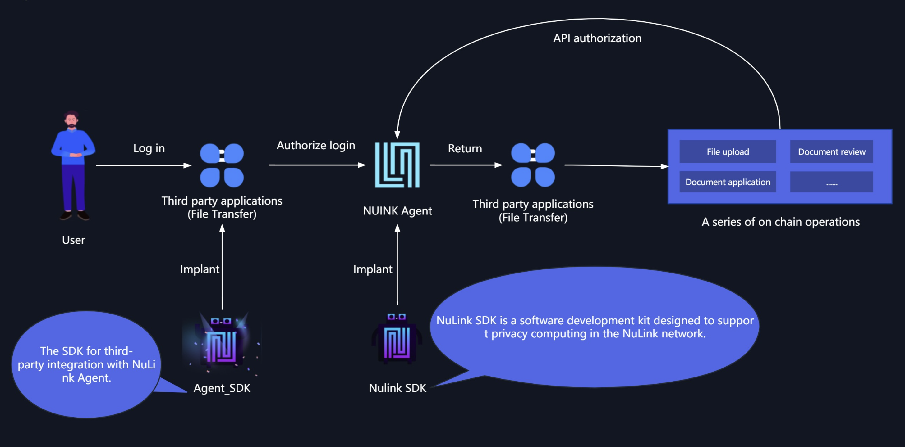

# Overview

The NuLink network is composed of multiple layers, namely the Application Layer, Cryptography Layer, Storage Layer, Blockchain Layer, and Watcher Network. Each layer serves a specific purpose in the system's architecture.

The Application Layer acts as the bridge between the system and the applications utilizing the NuLink network. It facilitates direct communication with the applications and also collaborates with the Cryptography Layer to validate access to confidential information within the applications. The Application Layer consists of three main components: NuLink Agent, NuLink Agent-SDK, and NuLink SDK.

* [**NuLink Agent:**](nulink_agent.md) NuLink Agent is a web-based digital wallet that facilitates seamless communication and interaction between the NuLink network and applications. It acts as an intermediary, relaying requests and responses between applications and the underlying layers of the NuLink network.

* [**NuLink Agent SDK:**](../dev/agent_sdk.md) The NuLink Agent-SDK provides developers with essential software development tools and resources. It empowers them to integrate NuLink Agent functionality into their applications, enabling secure and efficient communication with the NuLink network.

* [**NuLink SDK:**](../dev/agent_sdk.md) The NuLink SDK is a robust and comprehensive software development kit designed to provide developers with a wide range of capabilities. It empowers developers to establish flexible connections with the NuLink network, enabling them to perform advanced cryptographic operations and interact with the network seamlessly. It's important to note that the NuLink Agent is implemented using the NuLink SDK, harnessing its powerful features to facilitate secure communication and interaction between applications and the NuLink network. By leveraging the NuLink SDK, developers can unlock the full potential of the NuLink ecosystem and build applications that leverage advanced cryptographic functionalities for enhanced security and privacy.

These components within the Application Layer work in harmony, enabling seamless integration and interaction with the NuLink network. By utilizing the NuLink Agent and its SDKs, developers can build applications that securely interact with the NuLink ecosystem.

The relationships between these components and layers are visualized in a diagram, highlighting the interconnectedness and collaborative nature required for the successful operation of the NuLink network.

In addition, we offer a demonstration Dapp called "File Transfer" that showcases the integration of the NuLink Agent into an application. 

* [**File Transfer:**](agent_usecase.md) The "File Transfer" Dapp serves as a third-party example, illustrating the utilization of the NuLink Agent SDK to interact with the NuLink Agent. This demonstration highlights the seamless integration and functionality provided by the NuLink Application Layer, allowing developers to leverage the NuLink network's capabilities for secure file transfers and data sharing.
