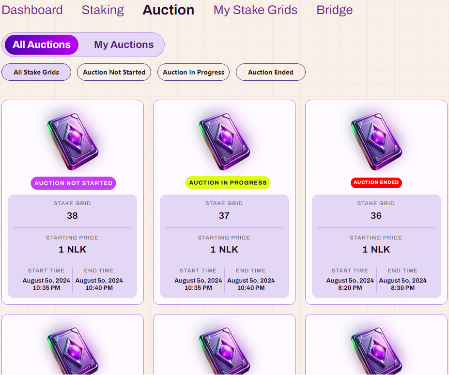
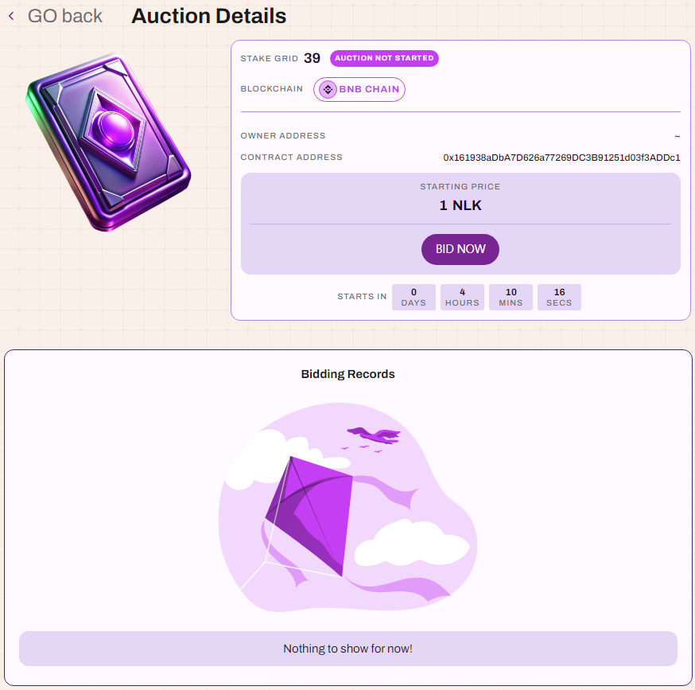
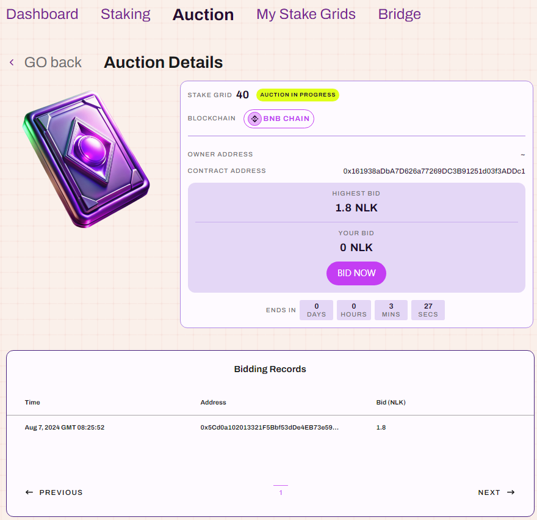
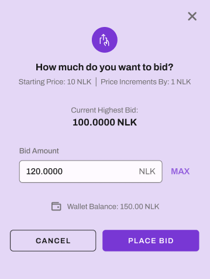
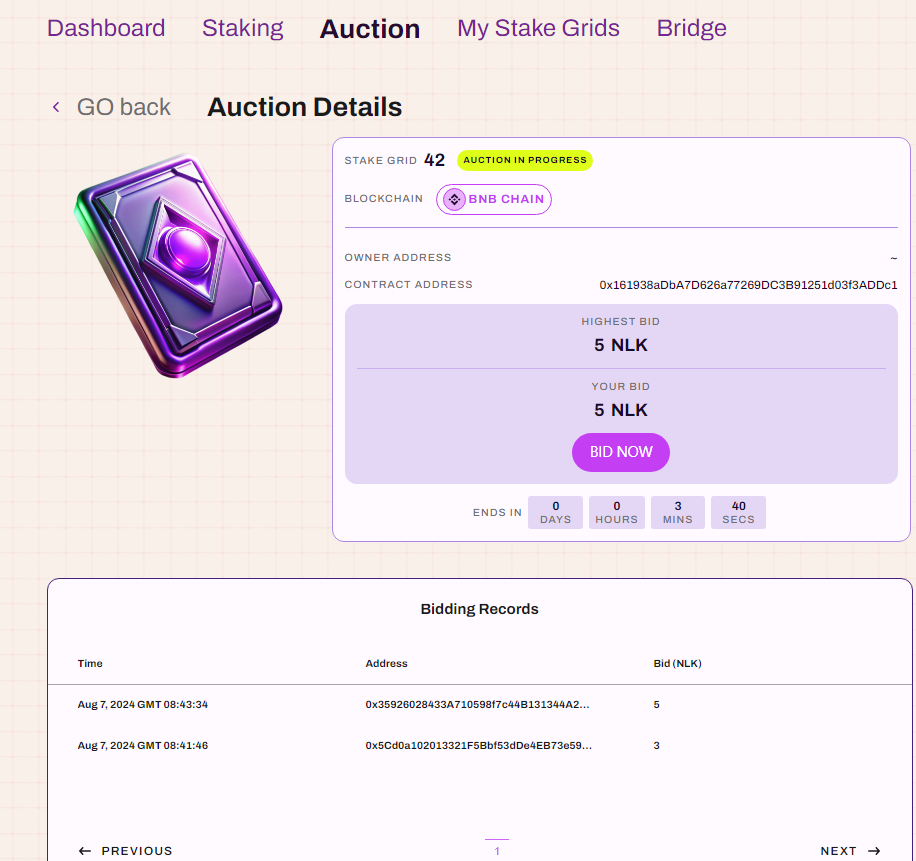
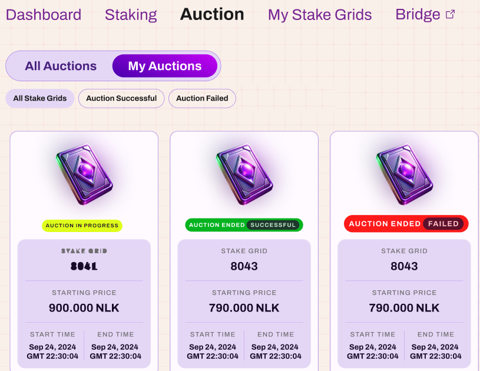

# Auction

## All Auctions

As shown below, all auctioned staking grids are displayed here. 
The auction status can be one of three types: `Auction Not Started`, `Auction In Progress`, and `Auction Ended`.

* (1) Auction Not Started

Enter the `Auction Not Started` details page to view the basic properties of the slot. 

You cannot bid yet, as the `BID NOW` button is disabled. Bidding is allowed only once the auction begins.

* (2) Auction In Progress

Enter the `Auction In Progress` details page to view the current highest bid and all bid records. 
You can place a bid by clicking `BID NOW`, which will trigger a bidding pop-up:

The pop-up will show the starting bid and increment amount. 
Your bid must be greater than or equal to the sum of the current highest bid and the increment amount. 
Once successfully placed, your bid will be displayed, as shown below:

* (3) Auction Ended

After the auction ends, you can see whether your bid was successful or not.

As shown in the image, there are three statuses for the staking grids you participated in bidding on: 
`AUCTION IN PROGRESS`, `AUCTION ENDED SUCCESSFUL`, and `AUCTION ENDED FAILED`. 

For the staking grids that were successfully auctioned, you can go to `My Stake Grids -> Uninstalled` to view and install them.
