# NuLink Staking Dashboard

## Overview
NuLink Staking Dashboard is a platform for managing the staker/worker account. Users could log in his staking account through the Metamask wallet, stake NLKs(test), and bond `Worker` account to get the reward. You can access NuLink Staking DApp through this [link](https://dashboard.testnet.nulink.org).

**Remark:**
To access the NuLink Dashboard for the Horus network, users must obtain the initial funds of NLKs (test) and BNBs (test) by clicking the faucet button located in the upper right corner.

  

## Work Flow

### Step1- Connect Wallet and Log in staking account

NuLink currently supports only METAMASK wallet. Users need to [download](https://metamask.io/download/) and install METAMASK wallet ahead. If you need more help with METAMASK usage, please refer [here](https://metamask.io/faqs/). Please create an account for staking in METAMASK after installation. 

Once create a staking account in METAMASK wallet, log in and connect the staking account in [NuLink Staking DApp](https://dashboard.testnet.nulink.org). Click the "Connect Wallet" at the top right corner of the page, and a pop-up window connecting to METAMASK wallet will appear. Click the "Connect Wallet " in the pop-up window, and the METAMASK wallet plug-in will be invoked.  

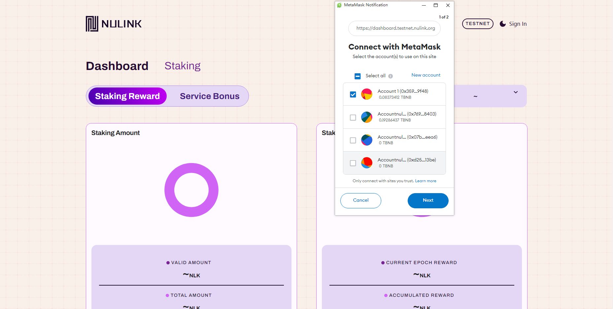  

After connecting with METAMASK Wallet, the system will automatically detect whether you connect to the NuLink network. If not, it automatically prompts a window for you to switch to the correct network.  

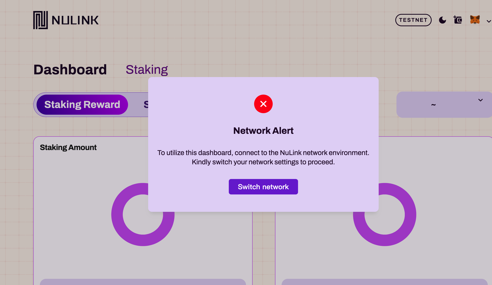  

**Remark:** The default RPC server for BSC testnet sometime is unstable. If you find the current server is done, please find an active one [here](https://chainlist.org/)  and replace it in METAMASK network setting. Need [help](https://metamask.zendesk.com/hc/en-us/articles/4404424659995-User-Guide-Custom-networks-and-sidechains) editing RPC server in METAMASK?

### Step2- Stake NLKs(test) to the staking pool
Once log in with METAMASK wallet, please check the balance.

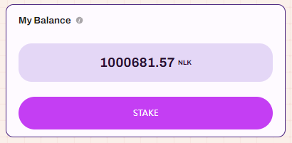

If the account is not approved, a prompt will appear to initiate the approval process first.

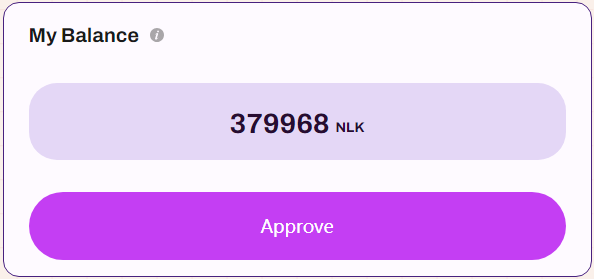

After approval, click the "Stake" button to stake tokens in the staking pool. Ensure there is a sufficient token deposit in the staking account as initial funds. Remember to bond an active worker after staking; otherwise, no rewards will be issued.

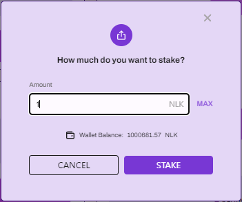  

You can customize the input for the amount to stake. Clicking "MAX" will input the entire balance. After confirming the amount, clicking the "STAKE" button will trigger the wallet to pay the gas fee. Upon successful payment, the staking process will be completed.

### Step3- Bond an active worker to gain reward

To be eligible for rewards, an active Worker node is required. Please refer [here](nulink_worker.md) for instructions on running a Worker. Here showcases `Node Information`, displaying data such as: NODE IP, STAKER ADDRESS, WORKER ADDRESS, and WORKER STATUS. Configuring the Worker node is a prerequisite for earning Staking rewards and Service bonuses.

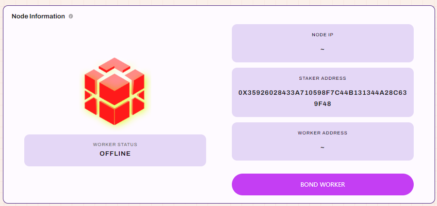

The "Bond Worker" page will pop up when you click on `Bond Worker`. Simply enter the Worker Address, and then confirm the bonding.

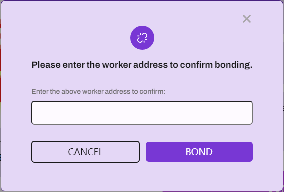

Now that the entire staking process is complete, your staked amount will be displayed in two sections: the staking pool and the pending pool. When you stake during the current epoch, it will initially be transferred to the pending pool. It will automatically move to the staking pool when the next epoch begins. Rewards in NLKs (test) will be distributed based on the staked amount in the staking pool.

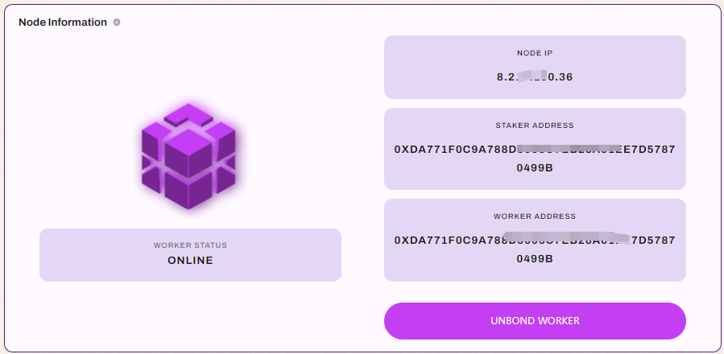

### Step4- Stop staking and quit

Follow the checklist below to stop the staking and get all funds along with reward:
* Unbound Worker and shut down the Worker node
* Unstake your fund from staking pool
* Claim reward and deposit

#### How to unbound Worker and shut down the Worker node?

Click  `Unbound Worker`. It will prompt a window to confirm unbond operation. 

After unbonding Worker, the Worker node is free to closed.

#### How to unstake?
Click the `Unstake` pop-up a  window to prompt whether to unstake. 

 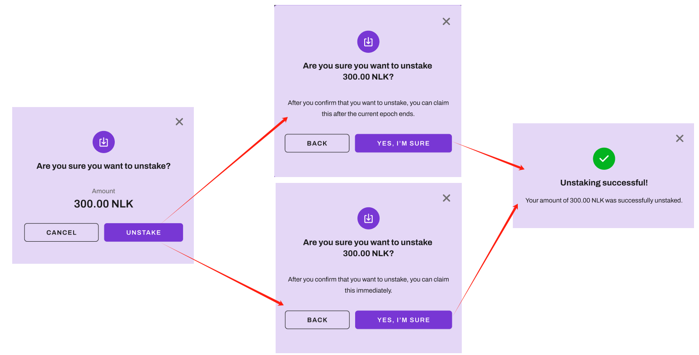

Please note that the staked amount in the pending pool can be claimed immediately upon unstaking, whereas the staking amount in the staking pool becomes claimable starting from the next epoch. 
As shown in the image,  1 NLK in the pending pool is eligible for immediate retrieval. However, the outstanding 1 NLK in the staking pool will be credited subsequent to the conclusion of the current period.

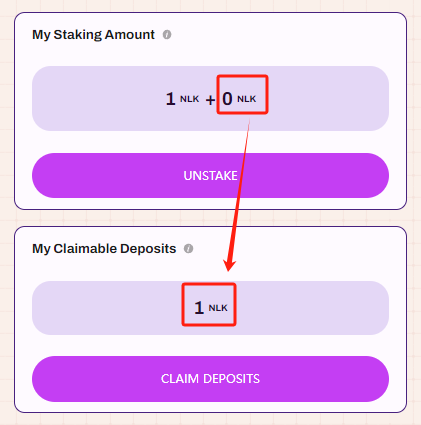

Initiating the deposit claim can be done by clicking `CLAIM DEPOSITS`. This action triggers a prompt for the wallet to pay the gas fee. Upon completion of the payment, the withdrawal is successful, and the deposited amount will be returned to your balance.

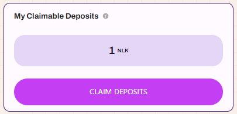

#### How to withdraw your reward?

The image below displays the details of "My Reward": 
"CLAIMABLE REWARDS" indicates the currently available withdrawable rewards, 
while "ACCUMULATED REWARD" reflects the total accumulated rewards from all epochs. 

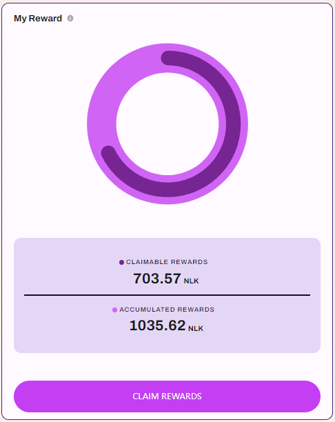

Clicking `CLAIM REWARDS` triggers the wallet to pay the gas fee. 
Upon successful payment, the rewards will be withdrawn to your balance.

