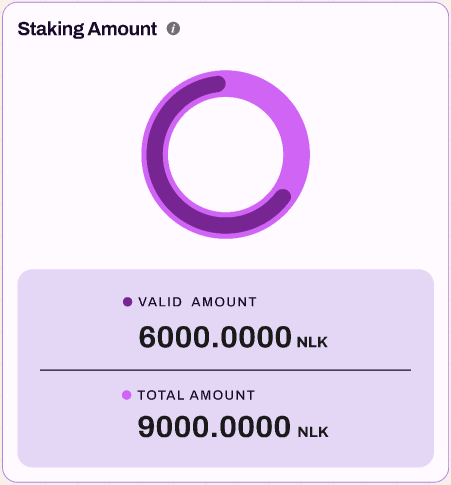
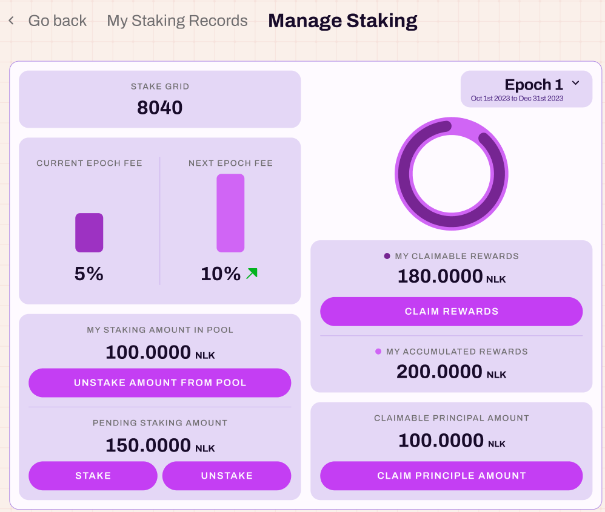

# NuLink Staking Dashboard

## Overview
NuLink Staking Dashboard is a platform for managing the staker/worker account. Users could log in his staking account through the Metamask wallet, stake NLKs(test), and bond `Worker` account to get the reward. You can access NuLink Staking Dashboard through this [link](https://dashboard.testnet.nulink.org).

**Remark:**
To access the NuLink Dashboard for the Horus network, users must obtain the initial funds of NLKs (test) and BNBs (test) by clicking the faucet button located in the upper right corner.

  

## Work Flow

### Step1 - Connect Wallet and Log in staking account

NuLink currently supports only METAMASK wallet. Users need to [download](https://metamask.io/download/) and install METAMASK wallet ahead. If you need more help with METAMASK usage, please refer [here](https://metamask.io/faqs/). Please create an account for staking in METAMASK after installation. 

Once create a staking account in METAMASK wallet, log in and connect the staking account in [NuLink Staking Dashboard](https://dashboard.testnet.nulink.org). Click the "Connect Wallet" at the top right corner of the page, and a pop-up window connecting to METAMASK wallet will appear. Click the "Connect Wallet " in the pop-up window, and the METAMASK wallet plug-in will be invoked.  

  

After connecting with METAMASK Wallet, the system will automatically detect whether you connect to the NuLink network. If not, it automatically prompts a window for you to switch to the correct network.  

  

**Remark:** The default RPC server for BSC testnet sometime is unstable. If you find the current server is done, please find an active one [here](https://chainlist.org/)  and replace it in METAMASK network setting. Need [help](https://metamask.zendesk.com/hc/en-us/articles/4404424659995-User-Guide-Custom-networks-and-sidechains) editing RPC server in METAMASK?

### Step2 - Stake NLKs(test) to the staking pool
Once log in with METAMASK wallet, please check the balance.

If the account is not approved, a prompt will appear to initiate the approval process first.

After approval, click the "Stake" button to stake tokens in the staking pool. Ensure there is a sufficient token deposit in the staking account as initial funds. Remember to bond an active worker after staking; otherwise, no rewards will be issued.

  

You have the flexibility to customize the input for the amount you wish to stake. By clicking "MAX," you can input your entire balance for staking. After confirming the chosen amount, clicking the "STAKE" button will prompt your wallet to process the payment for the gas fee.

Upon successful payment, you'll observe your staked amount reflected in two sections: the staking pool and the pending pool. When you stake during the current epoch, the amount will initially be transferred to the pending pool. It automatically transitions to the staking pool as soon as the next epoch begins. NLK (test) rewards will be distributed based on the staked amount in the staking pool.

### Step3 - Bond an active worker to gain reward

To be eligible for rewards, an active Worker node is required. Please refer [here](nulink_worker.md) for instructions on running a Worker. Here showcases `Node Information`, displaying data such as: NODE IP, STAKER ADDRESS, WORKER ADDRESS, and WORKER STATUS. Configuring the Worker node is a prerequisite for earning Staking rewards and Service bonuses.

The "Bond Worker" page will pop up when you click on `Bond Worker`. Simply enter the Worker Address, and then confirm the bonding.

Now that the entire staking process is complete, and  you can now monitor the status of your worker node in the dashboard.

### Step4 - Stop staking and quit

Follow the checklist below to stop the staking and get all funds along with reward:
* Unbound Worker and shut down the Worker node
* Unstake your fund from staking pool
* Claim reward and deposit

#### How to unbound Worker and shut down the Worker node?

Click  `Unbound Worker`. It will prompt a window to confirm unbond operation. 

After unbonding Worker, the Worker node is free to closed.

#### How to unstake?
Click the `Unstake` pop-up a  window to prompt whether to unstake. 

 

Please note that the staked amount in the pending pool can be claimed immediately upon unstaking, whereas the staking amount in the staking pool becomes claimable starting from the next epoch. 
As shown in the image,  1 NLK in the pending pool is eligible for immediate retrieval. However, the outstanding 1 NLK in the staking pool will be credited subsequent to the conclusion of the current period.

Initiating the deposit claim can be done by clicking `CLAIM DEPOSITS`. This action triggers a prompt for the wallet to pay the gas fee. Upon completion of the payment, the withdrawal is successful, and the deposited amount will be returned to your balance.

#### How to withdraw your reward?

The image below displays the details of "My Reward": 
"CLAIMABLE REWARDS" indicates the currently available withdrawable rewards, 
while "ACCUMULATED REWARD" reflects the total accumulated rewards from all epochs. 

Clicking `CLAIM REWARDS` triggers the wallet to pay the gas fee. 
Upon successful payment, the rewards will be withdrawn to your balance.

## Dashboard

The default landing page is the Staking Reward page.

The data is displayed based on periods, and it defaults to the current Epoch.
You can switch to view other Epochs by pulling down the menu.

### Staking Reward

1) Staking Amount

   The left panel displays the `Staking Amount` information:
   * `VALID AMOUNT` shows the current Epoch's valid amount of NLK staked
   * `TOTAL AMOUNT` indicates the total NLK staked across all Epochs

2) Staking Reward

   The right panel showcases the `Staking Reward` details:
   * `CURRENT EPOCH REWARD` represents the staking rewards generated in the current Epoch
   * `ACCUMULATED REWARD` is the cumulative staking rewards generated across all Epochs.

3) Total Staking Nodes Count

   Further below, there are three boxes displaying:
   * `Total Staking Nodes Count`: This reveals the total number of staking nodes.
   * `Current Epoch`: It indicates the current Epoch.
   * `Total Epoch`: It represents the total count of all Epochs.

4) Staking Reward Distribution

   The image below demonstrates the Staking Reward Distribution list, presenting comprehensive staking-related information for each user receiving rewards.

   * `Address`: The account address where the user stakes.
   * `Node IP`: Users need to bind their Node IP and ensure it remains online; otherwise, it may affect the reward amount.
   * `Staking Amount`: The amount of NLK staked by the user in the current Epoch.
   * `Living ratio`: This parameter measures the node's online duration (a higher value corresponds to higher rewards).
   * `Valid Staking Amount`: The NLK staked in the previous Epoch, which remains effective in the current Epoch if not unstaked.
   * `Valid Staking Quota`: The proportion of valid NLK staked in the current Epoch relative to the total staked amount.
   * `Staking reward`: This calculates the user's expected reward based on Living ratio, Valid Staking Amount, and Valid Staking Quota.

### Staking Bonus

   Switching to the Staking Bonus page, as shown below, the data is displayed based on Batches. 
   By default, it shows the current Batch, but users can scroll down to view other Batches.

1) Staking Bonus

The left panel displays the `Service Bonus` information: 
* `CURRENT BATCH BONUS` indicates the Bonus amount generated in the current Batch
* `CUMULATIVE BATCH BONUS` represents the total Bonus amount generated across all Batches.

2) Batches
The right panel showcases the `Batches` details:
* `CURRENT BATCH` shows the current Batch
* `TOTAL BATCH` represents the total count of all Batches.

3) Service bonus from each blockchain

The image below presents the Service bonus from each blockchain.

Currently, only BSC is supported, and other chains will gradually become available.

4) Service bonus distribution
The following image illustrates the Service bonus distribution, which is awarded only to users who have activated nodes and bound workers.

Users receive 80% of the `Service Bonus` based on their Reputation score quota (Reputation score is related to online rate; the higher the online rate, the higher the score).

5) Foundation Distribution
The image below demonstrates the Foundation Distribution, where 15% of the Service bonus generated in each Batch is allocated to the foundation.

6) Burning Record

This image illustrates the Burning Record, where 5% of the Service bonus from each Batch is burned.

### My Staking

Clicking on the `Staking` tab will display your staking information.

1) Staking Amount

As shown in the figure below, the left panel displays the `Staking Amount` information:
* `VALID STAKING AMOUNT` shows the valid staked quantity for the current period
* `TOTAL STAKING AMOUNT` represents the cumulative staked total.

2) Staking Node

The right panel shows the "Staking Node" information: displaying the total count of staked nodes.

Continuing down, the following image displays your staking details, including `My Balance`, `My Staking Amount`, `My Claimable Deposits`, and `My Reward`.

3) My Balance

Upon logging in, your Balance amount is visible. 

Clicking on `STAKE` will display the STAKE operation interface.

4) My Staking Amount
After staking, the details can be seen here. 
The left side displays the staking amount that has already taken effect, while the right side indicates the staking amount that hasn't taken effect yet and will be effective in the next period. 

Clicking `UNSTAKE` prompts a confirmation popup to release all staked amounts.

5) My Claimable Deposits

Here display your claimable deposits.

Clicking `CLAIM DEPOSITS`, the deposits can be successfully claimed upon successful payment.

6) My Reward
The image below showcases `My Reward`: 
* `CLAIMABLE REWARDS` displays available rewards to claim
* `ACCUMULATED REWARD` shows the cumulative reward obtained in all Epochs. 

Clicking `CLAIM REWARDS` to claim your reward.

7) Node Information

The following image displays your Node Information, including NODE IP, STAKER ADDRESS, WORKER ADDRESS, WORKER STATUS.

For detailed worker node configuration steps, refer to the [tutorial](https://docs.nulink.org/products/stakers/nulink_worker).

Clicking `BOND WORKER` to bond your worker node.

8) Node Staking Amount

The image below showcases my Node Staking Amount, displaying data for the current Epoch, including:
* `MY VALID STAKING AMOUNT`: The valid staked amount I have.
* `MY TOTAL STAKING AMOUNT`: The total accumulated staked quantity.
* `NODE STAKING REWARD`: Rewards obtained after staking.
* `VALID STAKING QUOTA`: The ratio of the current Epoch's valid staked NLK amount to the total staked quantity.
* `LIVING RATIO`: This parameter measures the duration of the node's online status (the higher the value, the higher the rewards obtained).
