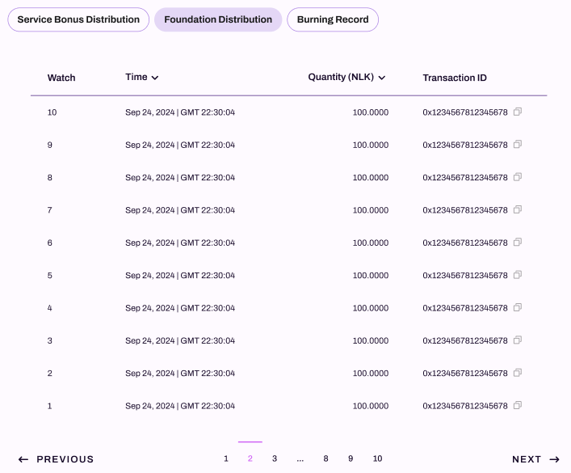

# Dashboard

The dashboard page include two sub-page, staking reward page and service bonus page.

## Staking Reward Statistics

The Staking Reward sub-page is the primary landing page for the NuLink Staking Dashboard, offering a comprehensive overview of staking activities. 
Data is organized by epochs, and the default view is set to the current Epoch. Users can switch to other epochs by using the dropdown menu.

### Staking Amount

The left panel displays the `Staking Amount` information:

  *  `VALID AMOUNT` shows the total valid staking amount of all stakers in the selected epoch.
  *  `TOTAL AMOUNT` indicates the total staking amount of all stakers in the selected epoch.

###  Staking Reward

The right panel showcases the `Staking Reward` details:

  * `CURRENT EPOCH REWARD` represents the staking rewards generated in current epoch.
  *  `ACCUMULATED REWARD` is the cumulative staking rewards generated across all Epochs.

###  Total Staking Grids Count

   Further below, there are three boxes displaying:

   * `Total Staking Grids` reveals the total number of stake grids in the displayed epoch.
   * `Current Epoch` indicates the user selected epoch number.
   * `Total Epoch` represents the total count of all epochs.

###  Staking Reward Distribution

The image below demonstrates the Staking Reward Distribution list, presenting comprehensive staking-related information for each user receiving rewards.

STAKE: Clicking this takes you to the staking details page, with detailed rules described in the "Staking" section.

   * `Stake Grid`: Slot number, used to distinguish between different slots.
   * `Current Epoch Fee`: The fee for the current epoch, set in the previous epoch.
   * `Next Epoch Fee`: The fee for the next epoch, to be set during the current epoch.
   * `Staking Number`: The number of participants in staking.
   * `Staking Amount`: The amount of NLK staked.
   * `Living ratio`: A metric within the NuLink network that represents the uptime of a node (higher values lead to greater rewards).
   * `STAKE`: Clicking this takes you to the staking details page, with detailed rules described in the [Staking](./staking.md) section.

## Service Bonus Statistics

To navigate to the Service Bonus page, simply click the `Service Bonus` button located in the dashboard menu. 
The displayed data is categorized by batches, with the default view set to the current batch. 
Users can easily scroll down to explore information from other batches.

### Service Bonus

The left panel displays the `Service Bonus` information: 
* `CURRENT BATCH BONUS` indicates the bonus amount generated in the user selected batch.
* `CUMULATIVE BATCH BONUS` represents the total bonus amount generated across all batches.

### Batches
The right panel showcases the `Batches` details:
* `CURRENT BATCH` shows the user selected batch number.
* `TOTAL BATCH` represents the total count of all batches.

### Service bonus from each blockchain

The image below presents the service bonus collected from each blockchain.

Currently, only BSC is supported, and other chains will gradually become available.

### Service bonus distribution

Scrolling further, you will see the `Service Bonus Distribution` section. 
Only users who have installed a Stake Grid and bound it to a worker are eligible to receive service bonuses. 
The distribution of 80% of the service bonus from each batch is based on each user’s Reputation Score Quota (the Reputation Score is related to the uptime of the node—the higher the uptime, the higher the score).

### Foundation Distribution
The image below demonstrates the Foundation Distribution, where 15% of the service bonus generated in each Batch is allocated to the NuLink Network Foundation's account.

### Burning Record

This image illustrates the Burning Record, where 5% of the service bonus from each Batch is burned.

