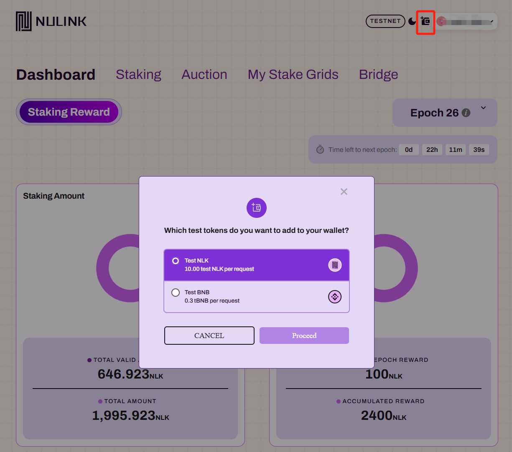

# NuLink Staking Dashboard

## Overview

The NuLink Staking Dashboard is a comprehensive platform for managing staking-related activities within the NuLink network. Users can log in to their staking accounts through the MetaMask wallet, bid for a grid, manage grid settings, stake NLK tokens to a grid, bond a `Worker` account to a grid for rewards, and more.

You can access the NuLink Staking Dashboard through this [link](https://dashboard.testnet.nulink.org).

Remark: For testnet user, users can obtain the initial funds of NLKs (test) and BNBs (test) by clicking the faucet button located in the upper right corner.

  

NuLink Staking dashboard provides users with the flexibility to choose between Dark and Light modes. To switch between these modes simply clicking the button next to the faucet button.

# Getting Started with the Staking Dashboard

The NuLink Staking Dashboard is a powerful tool designed to give stakers comprehensive control and insights into their staking activities on the NuLink network. The dashboard is organized into five main sections, each serving a specific purpose.

  

## 1. Dashboard

The **Dashboard** page serves as the main hub, providing an overview of key staking information and metrics. Refer [here](./dashboard.md) for detail instruction.

## 2. Staking

The **Staking** page allows users to manage individual staking options and assets, including staking, unstaking, and tracking rewards. Refer [here](./staking.md) for detail instruction.

## 3. Auction

The **Auction** section enables users to participate in grid auctions and submit bids for available grids. Refer [here](./auction.md) for detail instruction.

## 4. My Stake Grids

The **My Stake Grids** area allows users to manage their personal staking grids, including grid configuration and status. Refer [here](./grid.md) for detail instruction.

## 5. Bridge

The **Bridge** tool facilitates token transfers across different blockchain networks, providing flexibility and accessibility for stakers. *This page will be available soon.*

