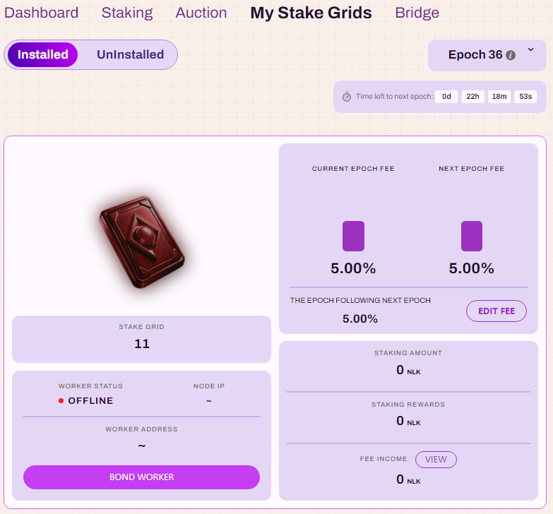
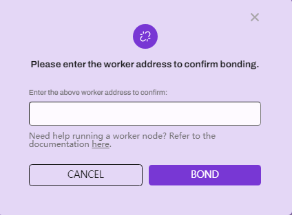
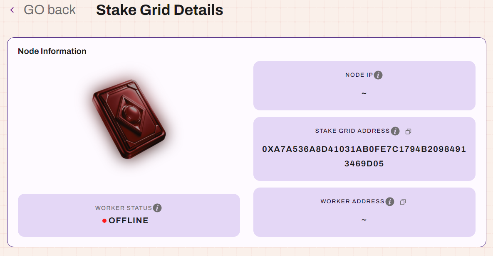
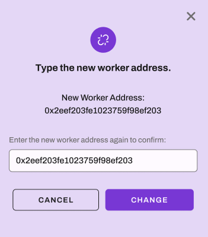
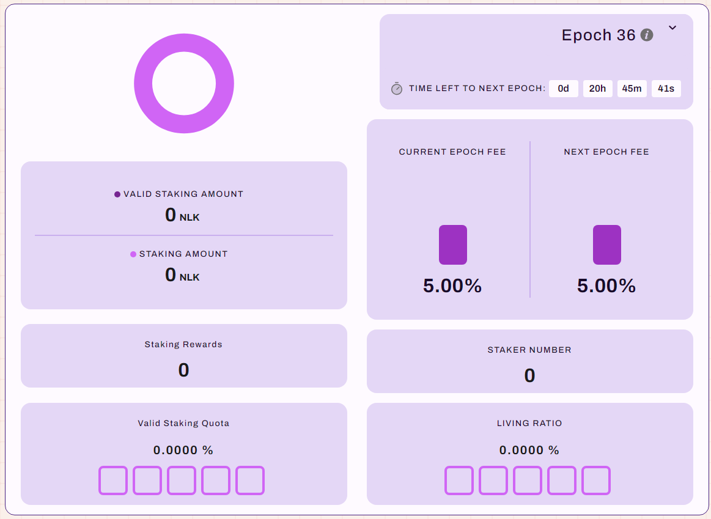
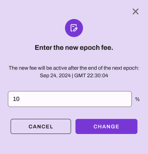
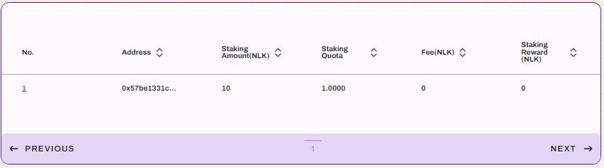
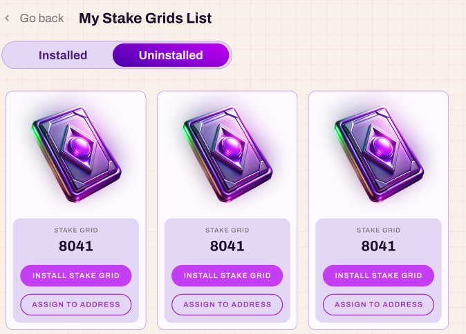
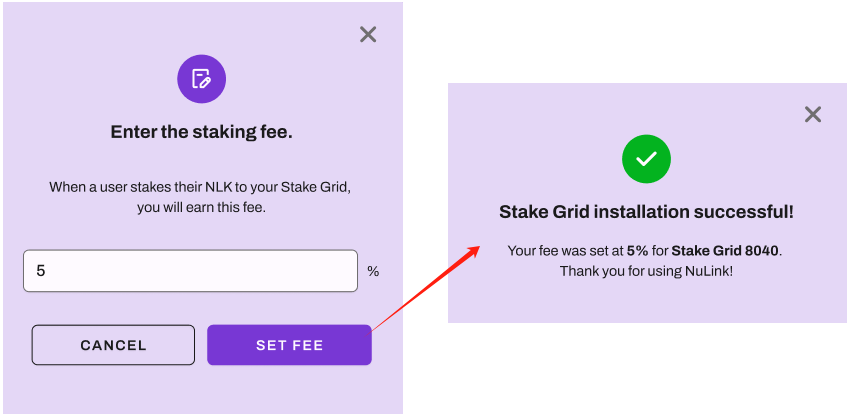
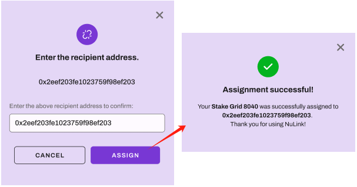

# My Staking Grids

This page shows all the staking grids you own, which are categorized into two statuses: 
`Installed` and `Uninstalled`.

The list displays all installed storage grids, where you can see the node-related information and staking overview for each grid.

## Install Grid

### BOND WORKER
Before a grid is officially open for staking, you need to `BOND WORKER` and start the node, 
as shown in the image below:

If you’re unsure how to start the node, please click to view the help manual.

### Stake Grid Details
Click `EDIT STAKE GRID` to view the grid’s details and staking overview. 

* Click `DETECT CURRENT STATUS`, if successful will return an `Online` status, otherwise `Offline`.
* 
* Click `UNBOND WORKER`, a pop-up will appear. Confirm to unbond the worker successfully.

* Click `CHANGE WORKER`, and a pop-up will appear. Enter the new address and submit to successfully change the worker.
  

* Click `EDIT INFO` to edit the grid’s description and social media content.

Scrolling down in the Stake Grid Details page, you can see the staking overview for the current period:

* `VALID STAKING AMOUNT`: TOTAL STAKING AMOUNT * LIVING RATIO
* `VALID STAKING QUOTA`: VALID STAKING AMOUNT / Platform-wide VALID STAKING AMOUNT
* `STAKING REWARD`: VALID STAKING QUOTA * Platform Total Reward
* `LIVING RATIO`: This parameter measures the uptime of the node (the higher the value, the higher the rewards).

Click `EDIT EPOCH FEE` to customize the fee for the epoch, as shown in the image below:

Scrolling further down, you can see all staking records under the grid.

## Uninstalled
   
This list shows all uninstalled grids, allowing you to install or transfer them. 

Click `INSTALL STAKE GRID` to display the pop-up below. Set the fee and submit to complete the installation.

Click `ASSIGN TO ADDRESS` to display the pop-up below. 
Enter the recipient's address. Upon submission, the wallet will prompt for gas payment. 
Once paid, the transfer is successful.

