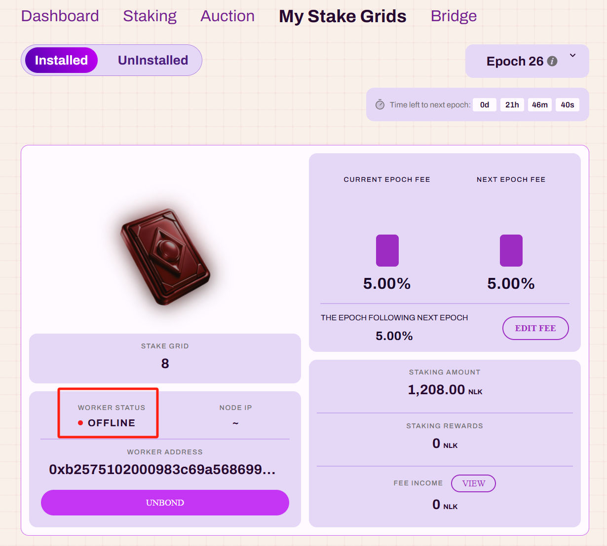

# NuLink Worker

## Overview  

The NuLink Worker is the node to provide cryptographic service in the NuLink network. It provides Proxy Re-encryption service in the Horus network and it will provide more services such as ABE, IBE, ZKP and FHE in NuLink mainnet. Only grid maintainers are required to run the NuLink Worker node. By continuously operating the worker node, grid maintainers remain eligible for rewards within the network.

There are four steps to run a NuLink Worker:
1. Create Worker Account
2. Bond the Worker Account with your grid
3. Install NuLink Worker
4. Configure and Run a Worker node

**Warning:** Do not use same address for staker account and worker account. Make sure to generate a new one for worker account.

## Minimum System Requirements  

* Debian/Ubuntu (Recommended)
* 30GB available storage
* 4GB RAM
* x86 architecture
* **Static IP address**
* **Exposed TCP port 9151, make sure it's not occupied**
* Nodes can be run on cloud infrastructure.

## Create Worker Account  

Prepare an ETH type account for the Worker. We suggest creating a Worker account different from the staking account. 

If you already know how to create one and access the keystore file, you can skip this step. Otherwise we recommend you to use Geth to create the Worker account.  Please check [here](./eth_account.md) for details.

## Bond the Worker Account with your grid  

Bond the worker account to your grid to get reward after successfully running a NuLink Worker node using the NuLink Staking Dashboard. 

- Navigate to [NuLink Staking Dashboard](https://dashboard.testnet.nulink.org) and go to My Stake Grid Page
- Select the grid you wish to bond and Click “Bond Worker” button
- Enter the Worker address and Click “BOND” button
- Sign the bond transaction in metamask

## Install NuLink Worker  

Start to download and install NuLink Worker.  Install it using Docker (recommended) or install it with local installation. See [here](./worker_install.md) for more details. 

## Initialize and Run a Worker Node  

Initialize the configuration and start the Worker Node. If install via docker, need to initialize the configuration and run it in Docker. Otherwise please check  [here](./worker_running.md) for more details regarding local running. 

After successfully running a worker node, you can check the Grid Status in the NuLink Staking Dashboard to confirm that it’s online or not.

Refer [here](./dashboardoverall.md) for more usage of NuLink Staking Dashboard.

