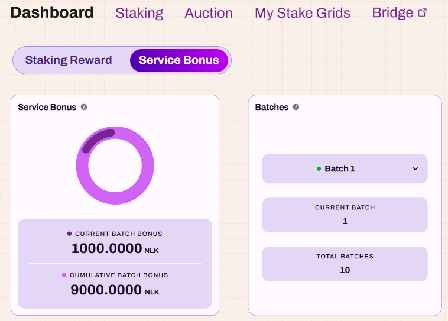

# Service Bonus Statistics

To navigate to the Service Bonus page, simply click the `Service Bonus` button located in the dashboard menu. 
The displayed data is categorized by batches, with the default view set to the current batch. 
Users can easily scroll down to explore information from other batches.

## Service Bonus

The left panel displays the `Service Bonus` information: 
* `CURRENT BATCH BONUS` indicates the bonus amount generated in the user selected batch.
* `CUMULATIVE BATCH BONUS` represents the total bonus amount generated across all batches.

## Batches
The right panel showcases the `Batches` details:
* `CURRENT BATCH` shows the user selected batch number.
* `TOTAL BATCH` represents the total count of all batches.

## Service bonus from each blockchain

The image below presents the service bonus collected from each blockchain.

Currently, only BSC is supported, and other chains will gradually become available.

## Service bonus distribution

Scrolling further, you will see the `Service Bonus Distribution` section. 
Only users who have installed a Stake Grid and bound it to a worker are eligible to receive service bonuses. 
The distribution of 80% of the service bonus from each batch is based on each user’s Reputation Score Quota (the Reputation Score is related to the uptime of the node—the higher the uptime, the higher the score).

## Foundation Distribution
The image below demonstrates the Foundation Distribution, where 15% of the service bonus generated in each Batch is allocated to the NuLink Network Foundation's account.

## Burning Record

This image illustrates the Burning Record, where 5% of the service bonus from each Batch is burned.

