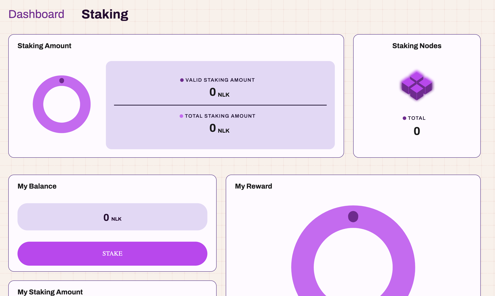
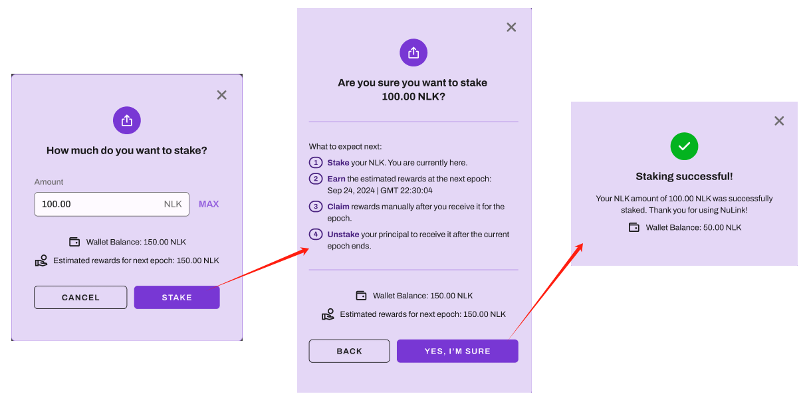
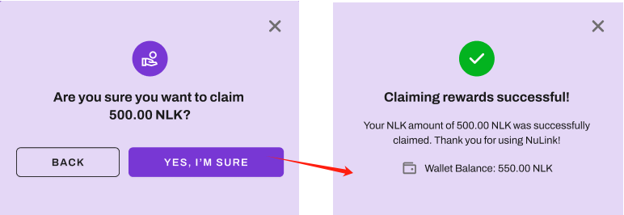
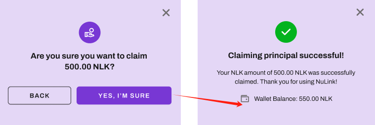
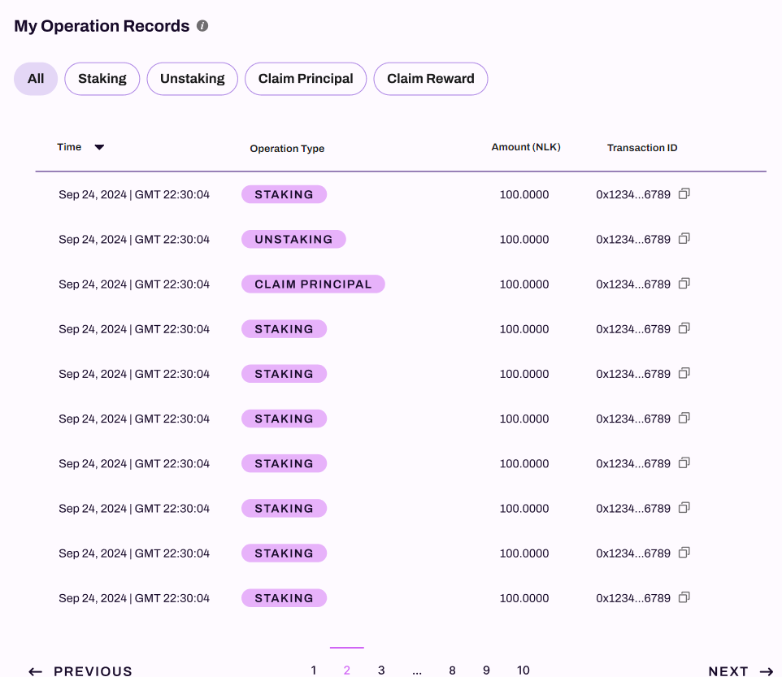
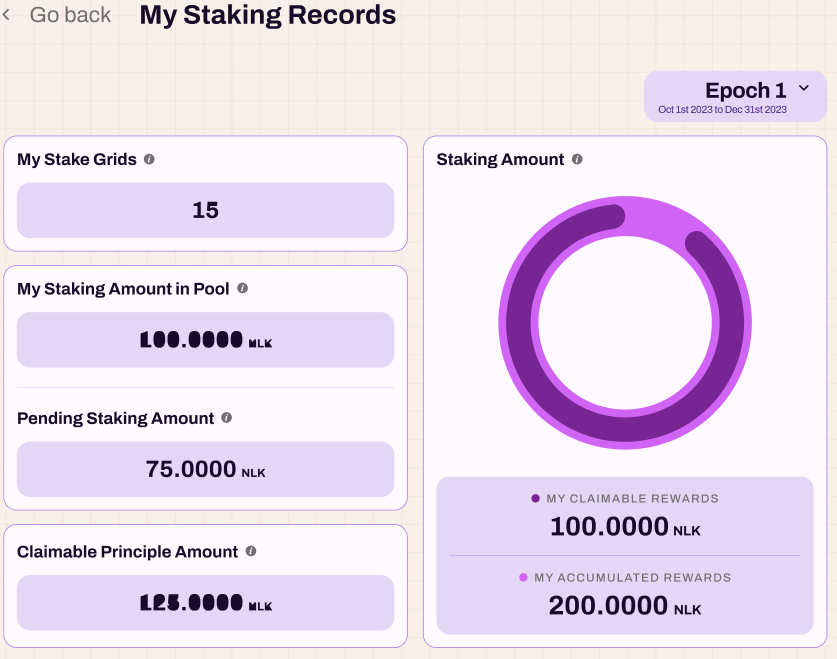
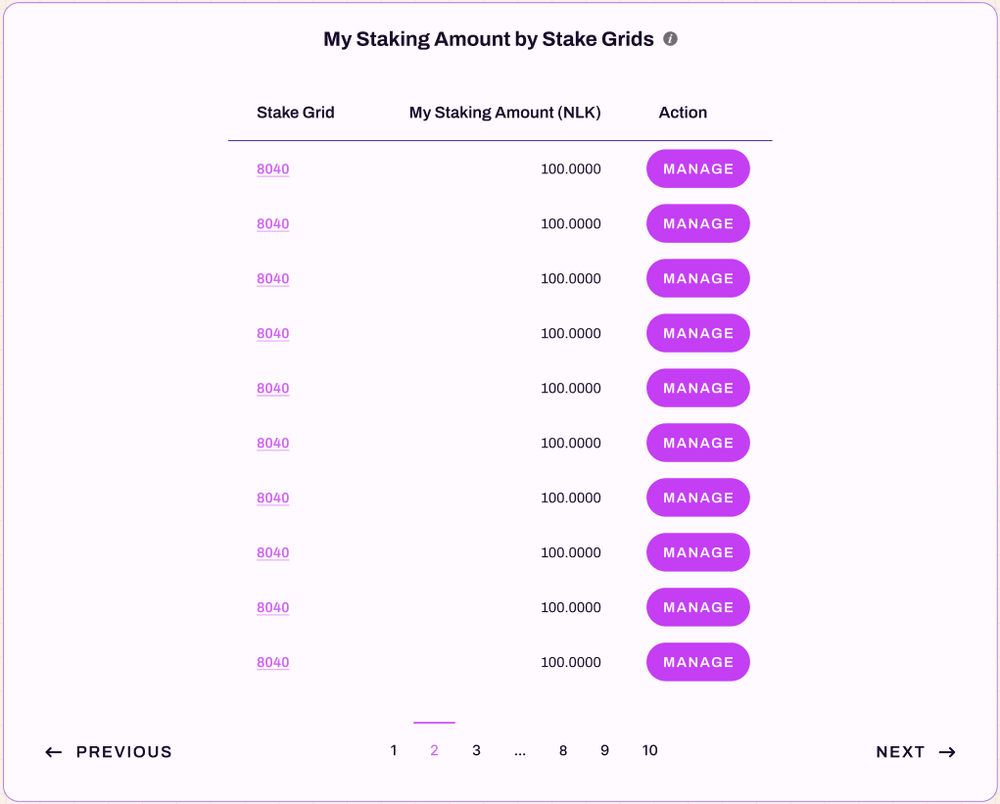
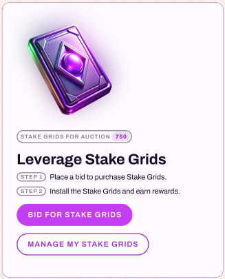

# Staking Management

After logging in, the left frame is for staking participants. Clicking "STAKE NLK NOW" will return to the "Staking Reward Distribution" page (1 -> 4), where you can select the slot you want to stake in. Click "STAKE" to enter the Manage Staking page.

This page provides access points for two roles: `Stake Participant` and `Grid Manager`.
Participation in staking requires users to log in first. 
Click `Sign In` at the top right, which will prompt the wallet authorization. 
Here, we will use the Metamask wallet as an example.

## Staing NLK & Earn Rewards

After logging in, the left section is for staking participants. 
Clicking `STAKE NLK NOW` will return to the `Staking Reward Distribution` page, where you can select the slot you want to stake in, Click `STAKE` to enter the `Manage Staking` page.

## Manage Staking

This page displays detailed information about your staking in the selected slot, including principal, staking rewards, etc.
The key difference between `MY STAKING IN POOL` and `PENDING STAKING AMOUNT` is that `MY STAKING IN POOL` represents the amount that has already taken effect during the current epoch, while `PENDING STAKING AMOUNT` represents the amount staked during the current epoch, which will take effect in the next epoch.

### Stake

Click `STAKE` to stake your NLK, as shown below:

You can manually enter the amount you wish to stake or click `MAX` to input your entire balance. 
After confirming the amount, click `STAKE`, which will trigger a pop-up to confirm the staking details, including the start of interest accrual and the time of withdrawal. 
Click `YES, I’M SURE` to trigger the wallet for gas fee payment. Once paid, the staking is successful.

### Unstake

There are two types of unstaking: `UNSTAKE AMOUNT FROM POOL` and `UNSTAKE`, as shown below:

* `UNSTAKE AMOUNT FROM POOL` will allow you to withdraw your principal after the current epoch ends.
* `UNSTAKE` will allow you to withdraw pending principal immediately.

### Claim Rewards

Interest is generated after each epoch ends. 
The interest will be settled and added to `MY CLAIMABLE REWARDS`. 
Users can then `CLAIM REWARDS` to transfer the interest to their wallet, as shown below:

### Claim Principal

If you no longer wish to stake, you can withdraw all your principal by clicking `CLAIM PRINCIPAL AMOUNT`,
as shown below:

### Operation Records

Scroll down further to view your activity history in this grid, including actions such as `Staking`, `Unstaking`, 
`Claim Principal`, and `Claim Rewards`.

## Staking Records

Click `VIEW STAKING RECORDS` to enter the Staking Records page, as shown below:

The page shows an overview of all your staking activity across all grids, including:

* `My Stake Grids`: The number of slots you have staked in.
* `My Staking Amount in Pool`: The total staked amount earning interest.
* `Pending Staking Amount`: The total pending staked amount, which will take effect in the next epoch.
* `Claimable Principal Amount`: The total amount of principal available for withdrawal.
* `MY CLAIMABLE REWARDS`: The total rewards available for claiming.
* `MY ACCUMULATED REWARDS`: The total accumulated rewards.
* 
Scroll down to see the list of all slots you have staked in:

Click `MANAGE` to go to the Manage Staking page mentioned earlier.

## Leverage Stake Grids

The right frame of the Staking page is for staking grid owners. 

Click `BID FOR STAKE GRIDS` to go to the Auction page. 
Detailed rules can be found in the `Auction` section. 
Click `MANAGE MY STAKE GRIDS` to go to the My Stake Grids page, with details in the `My Stake Grids` section.

