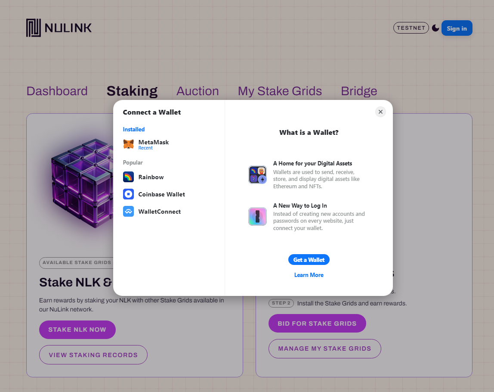

# Staking Management

To navigate to the personal staking management page by clicking the `Staking` button. 

## Step1 - Connect wallet and Log in staking account

NuLink currently supports only METAMASK wallet. Users need to [download](https://metamask.io/download/) and install METAMASK wallet ahead. If you need more help with METAMASK usage, please refer [here](https://metamask.io/faqs/). Please create an account for staking in METAMASK after installation. 

Once create a staking account in METAMASK wallet, log in and connect the staking account in [NuLink Staking Dashboard](https://dashboard.testnet.nulink.org). Click the "Connect Wallet" at the top right corner of the page, and a pop-up window connecting to METAMASK wallet will appear. Click the "Connect Wallet " in the pop-up window, and the METAMASK wallet plug-in will be invoked.  

  

After connecting with METAMASK Wallet, the system will automatically detect whether you connect to the NuLink network. If not, it automatically prompts a window to switch to the correct network.  

  

**Remark:** The default RPC server for BSC testnet sometime is unstable. If you find the current server is done, please find an active one [here](https://chainlist.org/)  and replace it in METAMASK network setting. Need [help](https://metamask.zendesk.com/hc/en-us/articles/4404424659995-User-Guide-Custom-networks-and-sidechains) editing RPC server in METAMASK?

## Step2 - Explore the personal staking information

After successfully logging in, the screen will display comprehensive staking information specific to the logged-in user. 

### Staking Amount

As shown in the figure below, the left panel displays the `Staking Amount` information:

 * `VALID STAKING AMOUNT` shows the total valid staking amount for the current epoch.
 * `TOTAL STAKING AMOUNT` represents the total staking amount for the current epoch.

### Staking Node

The right panel shows the "Staking Node" information: displaying the total count of staked nodes in the current epoch.

### My Balance

This box displays the balance amount of the logged-in user for the current epoch. The balance represents the available NLK tokens that the user can stake in the current epoch. 

### My Staking Amount

This box displays the staking amount of the logged-in user for the current epoch. The staked amount reflected in two sections: the staking pool and the pending pool. When the user stake during the current epoch, the amount will initially be transferred to the pending pool. It automatically transitions to the staking pool as soon as the next epoch begins. NLK (test) rewards will be distributed based on the staked amount in the staking pool.

User can clicking `UNSTAKE` to start the unstake process.

### My Claimable Deposits

This box display the claimable deposits of the logged-in user. Simply click `CLAIM DEPOSITS` to start to claim the deposit back.

### My Reward

This box shows the staking reward of the logged-in user, providing valuable insights into their staking journey. It presents two key statistics:

 * `CLAIMABLE REWARDS` represents all available rewards that the logged-in user can claim
 * `ACCUMULATED REWARD` showcases the cumulative rewards obtained by the logged-in user across all epochs. 

Users can claim these rewards by clicking `CLAIM REWARDS` button.

### Node Information

The following image displays the worker Node Information relate to the logged-in user, including NODE IP, STAKER ADDRESS, WORKER ADDRESS, WORKER STATUS. User can start the bonding process by clicking `BOND WORKER`.

### Node Staking Amount

This box displays the detailed staking information of the logged-in user for a specific epoch. Users can scroll down to select their desired epoch and view the corresponding staking details.

* `MY VALID STAKING AMOUNT`: The valid staking amount of the logged-in user in the selected epoch.
* `MY TOTAL STAKING AMOUNT`: The staking amount of the logged-in user in the selected epoch.
* `NODE STAKING REWARD`: The staking rewards of the logged-in user in the selected epoch.
* `VALID STAKING QUOTA`: The valid staking quota of the logged-in user in the selected epoch.
* `LIVING RATIO`: The living ratio of the logged-in user in the selected epoch.

## Step3 - Stake NLKs(test) to the staking pool

To start the staking process, please first check the balance.

If the account is not approved, a prompt will appear to initiate the approval process first.

After approval, click the "Stake" button to stake tokens in the staking pool. Ensure there is a sufficient token deposit in the staking account as initial funds. Remember to bond an active worker after staking; otherwise, no rewards will be issued.

  

The user have the flexibility to customize the input for the amount he wish to stake. After confirming the chosen amount, clicking the "STAKE" button will prompt wallet to process the payment for the gas fee.

## Step4 - Bond an active worker to gain reward

To be eligible for rewards, an active Worker node is required. Please refer [here](nulink_worker.md) for instructions on running a Worker. Here showcases `Node Information`, displaying data such as: NODE IP, STAKER ADDRESS, WORKER ADDRESS, and WORKER STATUS. Configuring the Worker node is a prerequisite for earning Staking rewards and Service bonuses.

The "Bond Worker" page will pop up when user click on `Bond Worker`. Simply enter the Worker Address, and then confirm the bonding.

Now that the entire staking process is complete, and user can monitor the status of his worker node in the dashboard.

## Step5 - Stop staking and quit

Follow the checklist below to stop the staking and get all funds along with reward:
* Unbound Worker and shut down the Worker node
* Unstake fund from staking pool
* Claim reward and deposit

### How to unbound Worker and shut down the Worker node?

Click  `Unbound Worker`. It will prompt a window to confirm unbond operation. 

After unbonding Worker, the Worker node is free to closed.

### How to unstake?
Click the `Unstake` pop-up a  window to prompt whether to unstake. 

 

Please note that the staked amount in the pending pool can be claimed immediately upon unstaking, whereas the staking amount in the staking pool becomes claimable starting from the next epoch. 
As shown in the image,  1 NLK in the pending pool is eligible for immediate retrieval. However, the outstanding 1 NLK in the staking pool will be credited subsequent to the conclusion of the current period.

Initiating the deposit claim can be done by clicking `CLAIM DEPOSITS`. This action triggers a prompt for the wallet to pay the gas fee. Upon completion of the payment, the withdrawal is successful, and the deposited amount will be returned to the balance.

### How to withdraw reward?

The image below displays the details of "My Reward": 
"CLAIMABLE REWARDS" indicates the currently available withdrawable rewards, 
while "ACCUMULATED REWARD" reflects the total accumulated rewards from all epochs. 

Clicking `CLAIM REWARDS` triggers the wallet to pay the gas fee. 
Upon successful payment, the rewards will be withdrawn to the balance.

