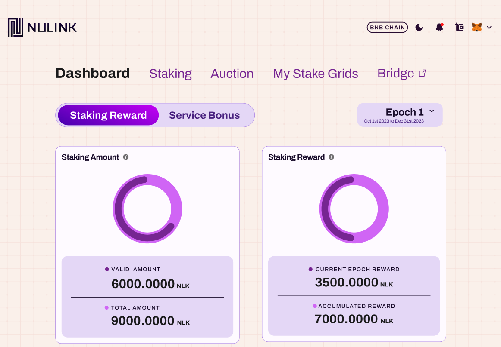

# Staking Reward Statistics

The Staking Reward page is the primary landing page for the NuLink Staking Dashboard, offering a comprehensive overview of staking activities. 
Data is organized by epochs, and the default view is set to the current Epoch. Users can switch to other epochs by using the dropdown menu.

## Staking Amount

The left panel displays the `Staking Amount` information:

  *  `VALID AMOUNT` shows the total valid staking amount of all stakers in the selected epoch.
  *  `TOTAL AMOUNT` indicates the total staking amount of all stakers in the selected epoch.

##  Staking Reward

The right panel showcases the `Staking Reward` details:

  * `CURRENT EPOCH REWARD` represents the staking rewards generated in current epoch.
  *  `ACCUMULATED REWARD` is the cumulative staking rewards generated across all Epochs.

##  Total Staking Grids Count

   Further below, there are three boxes displaying:

   * `Total Staking Grids` reveals the total number of stake grids in the displayed epoch.
   * `Current Epoch` indicates the user selected epoch number.
   * `Total Epoch` represents the total count of all epochs.

##  Staking Reward Distribution

The image below demonstrates the Staking Reward Distribution list, presenting comprehensive staking-related information for each user receiving rewards.

STAKE: Clicking this takes you to the staking details page, with detailed rules described in the "Staking" section.

   * `Stake Grid`: Slot number, used to distinguish between different slots.
   * `Current Epoch Fee`: The fee for the current epoch, set in the previous epoch.
   * `Next Epoch Fee`: The fee for the next epoch, to be set during the current epoch.
   * `Staking Number`: The number of participants in staking.
   * `Staking Amount`: The amount of NLK staked.
   * `Living ratio`: A metric within the NuLink network that represents the uptime of a node (higher values lead to greater rewards).
   * `STAKE`: Clicking this takes you to the staking details page, with detailed rules described in the [Staking](./staking.md) section.
