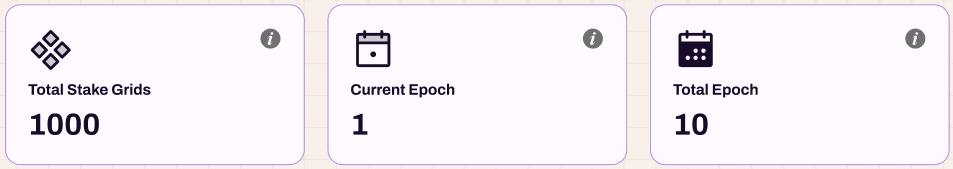
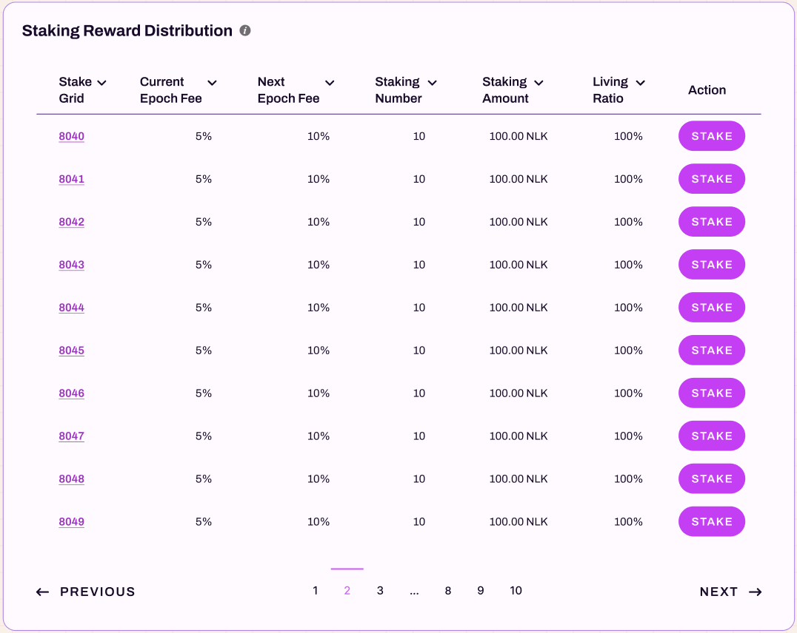

# Staking Reward Statistics

The Staking Reward page is the primary landing page for the NuLink Staking Dashboard, offering a comprehensive overview of staking activities. Data is organized by epochs, and the default view is set to the current Epoch. For insights into different epochs, navigate through the menu by pulling down and selecting the desired epoch.

## Staking Amount

The left panel displays the `Staking Amount` information:

  *  `VALID AMOUNT` shows the total valid staking amount of all stakers in the selected epoch.
  *  `TOTAL AMOUNT` indicates the total staking amount of all stakers in the selected epoch.

##  Staking Reward

The right panel showcases the `Staking Reward` details:

  * `CURRENT EPOCH REWARD` represents the staking rewards generated in the selected epoch.
  *  `ACCUMULATED REWARD` is the cumulative staking rewards generated across all Epochs.

##  Total Staking Nodes Count

   Further below, there are three boxes displaying:

   * `Total Staking Nodes Count`: This reveals the total number of stakers in the displayed epoch.
   * `Current Epoch`: It indicates the user selected epoch number.
   * `Total Epoch`: It represents the total count of all epochs.

##  Staking Reward Distribution

The image below demonstrates the Staking Reward Distribution list, presenting comprehensive staking-related information for each user receiving rewards.

   * `Address`: The account address where the user engages in staking activities.
   * `Node IP`: Node IP records the corresponding IP address of the worker nodes that the staker bonds
   * `Staking Amount`: The amount of NLK the staker puts in the staking pool in the selected Epoch.
   * `Living ratio`: A metric within the NuLink network that represents the proportion of stakers who are actively participating.
   * `Valid Staking Amount`: A dynamically adjusted quantity of tokens committed by a staker to the NuLink network as part of the staking process. It is calculated by multiplying the staking amount by the living ratio. This adjustment ensures that the staker's contribution is proportionate to the overall engagement and participation of stakers within the network.
   * `Valid Staking Quota`: The percentage of the total valid staking capacity that a staker contributes to the NuLink network for a specific epoch. It is calculated by dividing the staker's valid staking amount by the total valid staking amount in that epoch. This metric provides insights into the relative contribution of an individual staker to the overall staking dynamics of the NuLink ecosystem.
   * `Staking reward`: This calculates the user's reward based on the valid staking quota.
