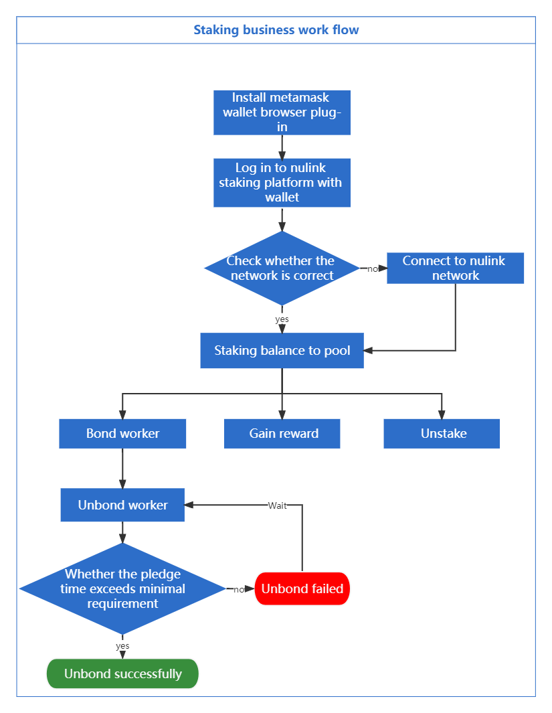
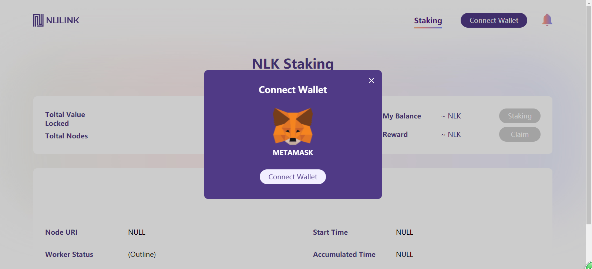
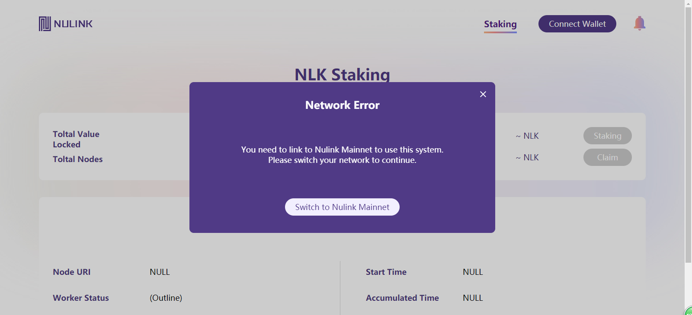
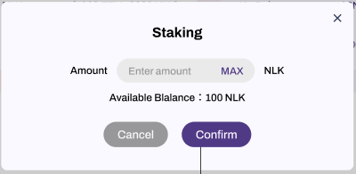
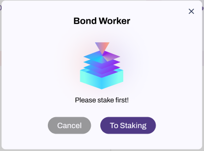
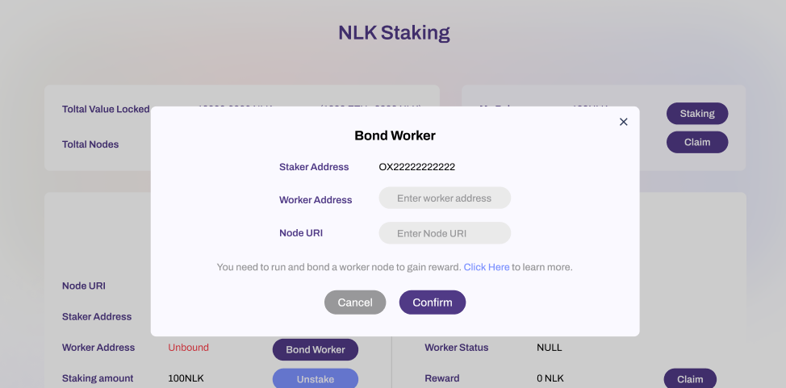
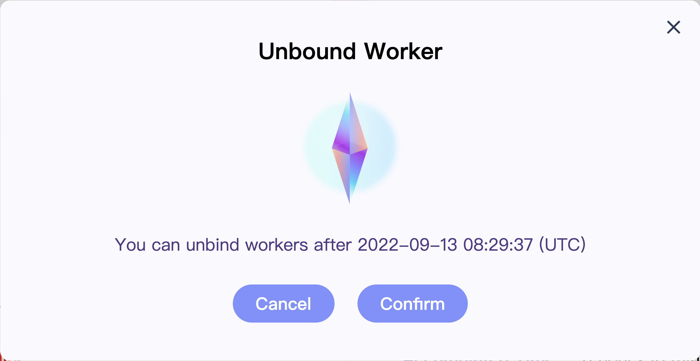
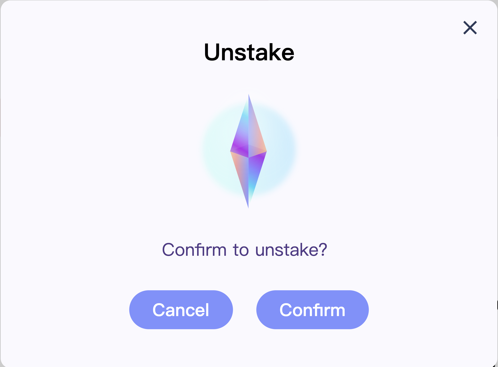
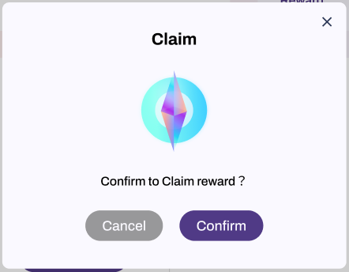

# NuLink Staking Dapp

## Overview
Nulink Staking Dapp is a platform for managing the staker/worker account. Users could log in his staking account through the Metamask wallet, stake NLKs(test), and bind Woker account to get the reward. You can access Nulink Staking Dapp through this [link](http://stake.nulink.org/).

In order to use NuLink Staking Dapp for NuLink testnet, the user needs to get the initial fund of NLKs(test) and BNBs(test) on [faucet](https://testnet.binance.org/faucet-smart). 

## Work Flow
  

### Step1- Initialization: Connect Wallet and Log in staking account

NuLink currently supports only METAMASK wallet. Users need to [download](https://metamask.io/download/) and install METAMASK wallet ahead. If you need more help with METAMASK usage, please refer [here](https://metamask.io/faqs/). After installation, you can create an account for staking in METAMASK . 

Once you create a staking account in METAMASK  wallet, you can login and connect your account in [Nulink Staking Dapp](http://stake.nulink.org/). You can click the "Connect Wallet" "at the top right corner of the page, and a pop-up window connecting to METAMASK wallet will appear. Click the "Connect Wallet " in the pop-up window, and the METAMASK wallet plug-in will be invoked.  

  

After connecting with METAMASK Wallet, the system will automatically detect whether you connect to the NuLink testnet. If not, it automatically prompts a window for you to switch to the correct network.  

  

### Step2- Staking your NLKs(test) to the staking pool
Once you log in with METAMASK wallet, you can check your balance and click the "Staking" button to stake your balance to the pool. Remember, you must bond an active worker after staking, otherwise you will not get any reward. 

  

### Step3- Bond an active worker to gain reward.
You need to run an active Worker node before you Click "Bond Worker". Please refer to [here](nulink_worker.md) for running a Worker. If you click "Bond Worker", it will first detect your staking status first:

* If you did not stake any funds to pool, a pop-up window will prompt you to stake first.

  

* If you did stake your fund to pool before, you will access the Bond Worker pop-up page.  Simplely enter the Worker Address and Node URI, and then confirm the bonding. Now you have completed the staking process and start to earn NLKs(test).

  

### step4- Stop staking and quit.

If you decide to stop the staking and get all funds along with reward, you have three things to do:
* Unbound Worker and shut down the Worker node
* Unstake your fund from staking pool
* Claim reward

#### How to unbound Worker and shut down the Worker node?
You need to click  “Unbound worker ". It will prompt a window for you to confirm unbond operation. 

   

Remark: There is a bond lock time(10 mintues) for NuLink testnet, which means you can not unbond within 10 mintues after bonding Worker.

   

After you unbond Worker, you can shut down your Worker node. Please refer [here]().

#### How to unstake?
Click the "Unstake" pop-up window to prompt whether to unstake. The staking can be released successfully after confirming.

   

#### How to withdraw your reward?
You can click "Claim" to withdraw the reward after unstaking your fund.

   

## Term Explaination in Dapp.

1. **Total Value Locked**: Total lock-in value of the NuLink testnet.  
2. **Total Nodes**: Total number of Worker nodes in the NuLink testnet.  
3. **My Balance**: Current balance in user's account, can be used for staking to pool.   
4. **Reward**: Unclaim reward of the user's account.  
5. **My Node Info**: Displays user node details, including the following data:  
  * Node URI: IP and Port of users’ Worker node.
  * Worker Status: The current status of user's Worker node. Either online or offline.
  * Staker Address: Address of the user's staking account.
  * Woker Address: Address of the user's Worker node.
  * Start time:  The time start to earn reward(finish staking and bonding), accurate to second.
  * Accumulated time:  Accumulated time for earning reward, accurate to second.
  * Reward: Unclaim rewards for the user .
  * Staking Amount: The amount of fund which user stake in the pool.
6. **Node List**: Displays all active nodes in the NuLink testnet, including the following data:  
  * Node URI: IP and Port of the Worker node.
  * Staker Address: Address of the node's staking account.
  * Woker Address: Address of the node's Worker node.
  * Worker Status:The current status of user's Worker node. Either online or offline.
7. **Notice List**: The bell in the right up corner, click to show all the transaction massages.  

