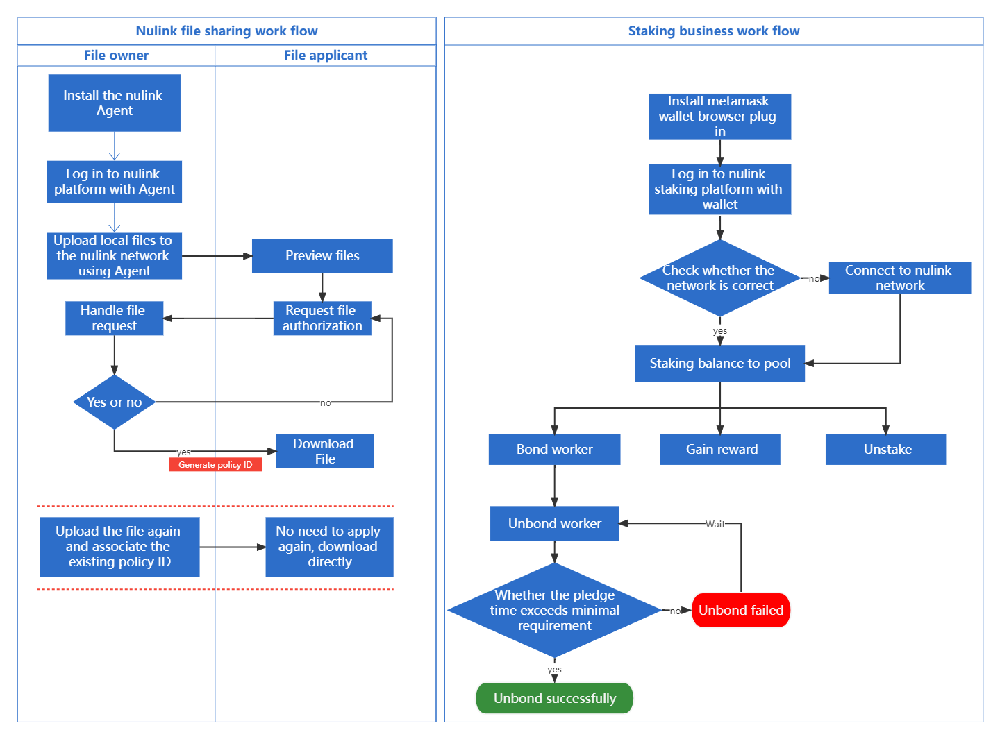

# Horus Testnet

## Overview

The NuLink Horus Testnet is a NuLink testnet environment. It includes four parts: the NuLink Staking Dapp, the NuLink Worker Node, the NuLink Agent and the NuLink File Sharing Dapp. The NuLink Staking Dapp and the  NuLink Worker Node are used by those who want to provide cryptographic service in the Horus network; while the NuLink Agent and the NuLink File Sharing Dapp are used by those who want to use the privacy-preserving service in the Horus network. The token in the Horus network is NLK(test). Please be aware it is only used for testing purpose and has no trading value. 

* [**NuLink Staking Dapp:**](staking_Dapp.md) The platform for managing the staker/worker account 

* [**NuLink Worker Node:**](nulink_worker.md) The node to provide cryptographic service in Horus. 

* [**NuLink Agent:**](nulink_agent.md) The plug in to handle the local cryptographic operation of the file sharing users.

* [**NuLink File Sharing Dapp:**](file_sharing_Dapp.md) The entrypoint for data sharing users to manage the private file and handle the authorization  request.

The Horus network is launched on BNB Smart Chain Testnet. The smart contract address is:

* **NuLink Token**: [0xDa627a1f6Bc94079b0c65C70B3B307799118943D](https://testnet.bscscan.com/address/0xDa627a1f6Bc94079b0c65C70B3B307799118943D)
* **NuLink Staking Pool**: [0x8582C8fcc25CB1C8967A779B4Fb2B947FdC85aA7](https://testnet.bscscan.com/address/0x8582C8fcc25CB1C8967A779B4Fb2B947FdC85aA7)
* **Simple PRE Application**: [0xD4E68C860e6b0943122550a38d3988902133Db25](https://testnet.bscscan.com/address/0xD4E68C860e6b0943122550a38d3988902133Db25)
* **Subscription Manager**: [0x574b8b4480056f406C1012e7041BFabaA3DC6ea6](https://testnet.bscscan.com/address/0x574b8b4480056f406C1012e7041BFabaA3DC6ea6)

## Characters

* **Staker/Workers:** Staker/workers refer to those  who stake their NLK token and provide the cryptographic service in the NuLink network. They need to deposit  their NLK token from his staking account using the NuLink staking Dapp first. And then they need to start a worker node by using the NuLink worker Installer. After the NuLink worker node is successfully started, they need to bond the NuLink worker node to his staking account by using the NuLink staking Dapp again. Remember, the staker must bond with an active worker to be eligible for staking reward.

* **File Sharing Users:** File sharing users refer to those who pay service fee to use the cryptographic service in the NuLink network. They need to install the NuLink Agent to access the NuLink file sharing Dapp. The file owner needs to pay the service fee in terms of NLK to grant access to any file request applicant. The file request applicants do not need to pay fees in the NuLink network. (Why do we charge fees for file owners instead of the file request applicants? Think about the commodity tax: the seller need to pay the tax, and they can charge this to the consumer by increasing the sell price. ) 

## Work Flow

