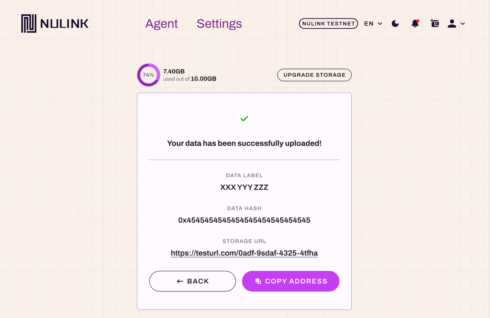
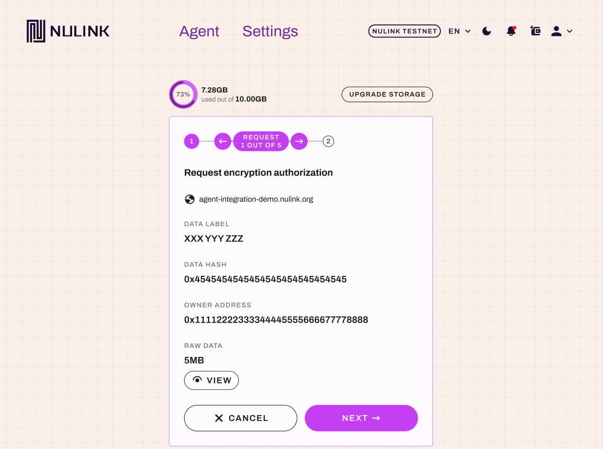
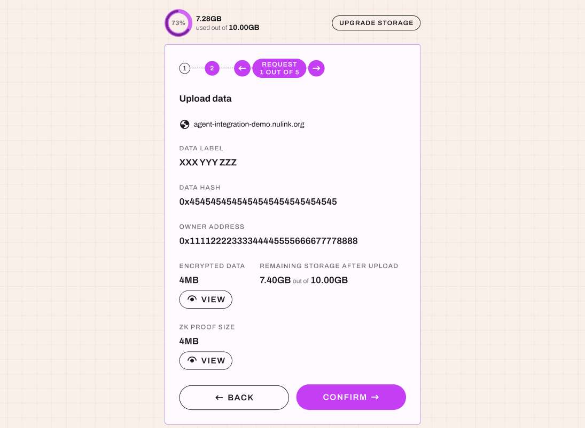
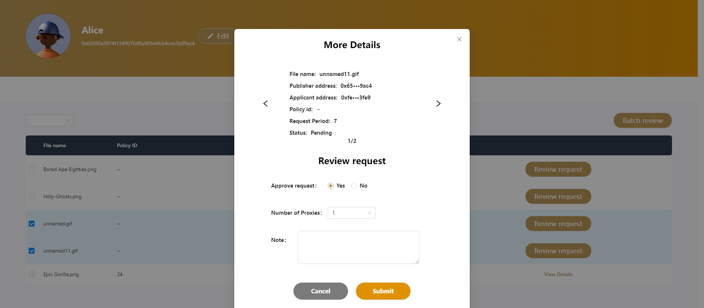

# DApp example
We provide a third-party demo example, a private file-sharing platform called [File Transfer](https://agent-integration-demo.nulink.org). 
The business process is as follows: users can freely upload and encrypt their own files on the platform, 
and other users can apply for the files they are interested in. 
Once the author approves the application, the applicant can download and view the encrypted file. 
Due to the privacy and security considerations of the files, all operations of this platform must be conducted through on-chain contracts. 
Next, we will focus on introducing the business scenario of the application and Agent integration.

We provide a third-party demo case, a private file-sharing platform called [File Transfer](https://agent-integration-demo.nulink.org).  
The business process is as follows: 
* Users can freely upload and encrypt their files on the platform. 
* Other users can apply for files they are interested in. 
* Once the author approves the application, the applicant can download and view the encrypted files. 

Considering the privacy and security of files, all operations on this platform must call on-chain contracts.

Next, we will focus on introducing the business scenario of the application and Agent integration.

This application requires authorization to log into the Agent account for normal access and operation.

Click `Agent` in the top right corner to call up the Agent authorization page.

## Agent Authorization Login

Before official authorization, enter your account password and click `confirm` to start the authorization.

As shown in the authorization page below, it displays the request source's address and my Agent account address.
Click `Confirm` and the page will automatically return to the third-party application page.

The figure below shows the File Transfer page of the third-party application, and it is logged in with the Agent's current account. If you have not uploaded any files, please click "Upload file" to upload files first.

The image below shows the third-party application 'File Transfer' page in the logged-in state, with the account being the currently logged-in Agent account. 
If you have not uploaded any files, please click `Upload File` first.

## File Upload -> Single File Upload

After selecting the local file to upload, you will be redirected to the Agent page to encrypt the file first, as shown below.

**Notice: the file size can not exceed 5M bytes.**

Click `NEXT` to start encryption.

After encryption, you will enter the file upload page, as shown below. 

Click `CONFIRM` to start the file upload.

After successful file upload, the following interface will be displayed:

## File Upload -> Multiple File Batch Upload

After selecting the local files to upload, you will be redirected to the Agent page to encrypt the files first, as shown below.

Click the `Left Arrow` or `Right Arrow` buttons on the progress bar to switch and view each file's details. 
And click `NEXT` to start encryption.

After encryption, you will enter the file upload page, as shown below.

Click `CONFIRM` to start the file upload.

After successful file upload, the following interface will be displayed:

## File Application

The figure below shows the file details page, and clicking "Request the file" can apply for the file. Enter the number of days you want to apply for and click "Submit."

The image below is the file detail page. 
Click `Request the file` to apply for the file.

Enter the desired number of days and click `Submit`.

Next, Agent will be called up for file application authorization, and the request details are shown below.

Click `CONFIRM` to apply.

After completing the authorization application, you will return to the third-party application page, 
and the file status will change to `pending`.

## File Approval

The image below is the author's list page of received applications.

* Single File Approval

Click `Review request` button next to the file list to view the application details, and click `Submit` if everything is fine.

* Multiple File Batch Approval
Select multiple files you wish to apply for, then click `Review request` button.
View the application details of the files, click the `Previous` and `Next` buttons to view different file application details, and click `Submit` if everything is fine.

Then the Agent authorization page will be called up, and the details of the approval request are shown below. 
Click `APPROVE` to proceed with the approval.

After completing the approval, you will return to the third-party application page, and the file status will change to `Approved`.

## File Download

The applicant re-enters the file detail page and sees that the application has been approved and can now download the file.

Click `Download now`.
Since it is an encrypted file, Agent authorization decryption page will be called up first. 
The request for decryption authorization information is shown below. 

Click `NEXT` to start file decryption.

After decryption, you will enter the file download page. 

Click `Confirm` and you will return to the third-party page to download.

The image below shows the returned third-party page, and as shown in the lower left corner, the file has been downloaded to the local machine through the browser.

Click on the file to view its content, as shown below.

